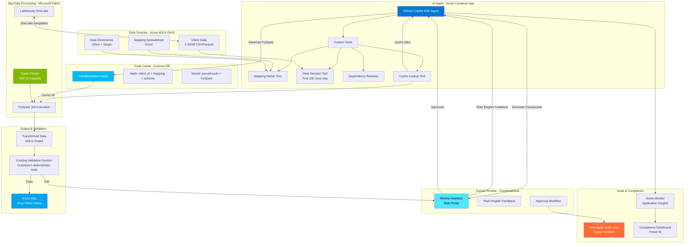

# AI Data Engineering Agent - Design Document

**Version:** 1.1  
**Date:** January 26, 2026  
**Status:** Draft

---

## Executive Summary

This document describes the architecture and design of an AI-powered data engineering agent that automates the transformation of client data from diverse source formats into a standardized output format. The agent uses GitHub Copilot SDK to analyze mapping spreadsheets, generate transformation code, and orchestrate PySpark jobs on Microsoft Fabric.

**Key Goals:**
- Reduce client onboarding time from 8 hours to 30 minutes
- Handle 1-10GB data files from 3,000+ clients
- Human-in-the-loop for safety and compliance via conversational feedback
- Cache successful transformations for deterministic re-runs
- Complete audit trail for regulatory compliance
- Cost-effective: $7.92/run vs $800 manual (99% reduction)

**Scale Requirements:**
- Normal operations: 300-400 runs/month
- Audit busy season (Feb-April): 1,000+ runs/month
- Total: 3,000 clients × 4-6 engagements/year = ~18,000 runs/year

---

## System Architecture

### High-Level Architecture Diagram



### Architecture Flow

**Phase 1: Analysis & Planning (AI-Powered)**
1. User triggers transformation for client
2. Agent checks cache (Cosmos DB) using hash(client_id + mapping + schema)
3. **Cache Hit**: Retrieve existing PySpark → Skip to Phase 2
4. **Cache Miss**: 
   - Parse mapping spreadsheet (Excel)
   - Sample first 100 rows of source data (not full 10GB)
   - Detect file dependencies and build execution order
   - Generate pseudocode transformation description

**Phase 2: Human Review (Conversational)**
5. Display pseudocode to user in web portal
6. User provides feedback in **plain English** (e.g., "Add validation for negative values")
7. Agent iterates on pseudocode based on feedback
8. User approves final version
9. Log approval action to immutable audit log

**Phase 3: Code Generation & Execution**
10. Agent converts approved pseudocode to executable PySpark
11. Store in Cosmos DB cache for future re-runs
12. Submit PySpark job to Microsoft Fabric Spark cluster
13. Fabric reads 10GB data from ADLS via OneLake integration
14. Execute transformations at scale
15. Write output to ADLS (standardized format)

**Phase 4: Validation & Loading**
16. Customer's **existing deterministic validation system** checks output
17. If validation passes → Load to Azure SQL (DNAV tables)
18. If validation fails → Feedback loop back to agent for refinement
19. All activities logged to Azure Monitor for audit trail

---

## Component Design

### 1. AI Agent Core (GitHub Copilot SDK)

**Purpose:** Orchestrate the entire pipeline using AI-powered planning and code generation.

**Capabilities:**
- Analyze mapping spreadsheets and data samples
- Generate pseudocode descriptions
- Convert pseudocode to executable PySpark
- Manage multi-step workflows
- Stream progress updates

**Implementation:**
```python
from copilot import CopilotClient

class DataEngineeringAgent:
    def __init__(self):
        self.client = CopilotClient()
        self.session = None
    
    async def analyze_transformation(self, mapping_path, data_samples):
        """
        Phase 1: Analyze and generate pseudocode
        """
        self.session = await self.client.create_session({
            "model": "gpt-5",
            "tools": [
                self.data_profiler_tool,
                self.mapping_parser_tool,
                self.validation_tool
            ]
        })
        
        prompt = f"""
        Analyze this data transformation task:
        - Mapping file: {mapping_path}
        - Data samples: {data_samples}
        
        Generate detailed pseudocode for transforming the client data 
        into standardized format. Include:
        1. Column mappings
        2. Data type conversions
        3. Validation rules
        4. Expected output structure
        """
        
        result = await self.session.send_and_wait({"prompt": prompt})
        return result
    
    async def generate_pyspark(self, pseudocode, approval_notes):
        """
        Phase 2: Generate executable PySpark code
        """
        prompt = f"""
        Convert this approved pseudocode into production-ready PySpark:
        
        {pseudocode}
        
        Human feedback: {approval_notes}
        
        Requirements:
        - Optimize for 1-10GB data files
        - Include error handling and logging
        - Add data quality checks
        - Use ADLS paths for input/output
        - Follow PySpark best practices
        """
        
        result = await self.session.send_and_wait({"prompt": prompt})
        return result.code
```

**Key Features:**
- **Custom Tools:** Data profiling, mapping parsing, validation
- **Multi-Turn Conversations:** Iterative refinement with human feedback
- **Streaming:** Real-time updates to review interface
- **Context Management:** Maintains state across analysis and generation phases

---

### 2. Authentication & Authorization

#### 2.1 Container App → ADLS Access

**Method:** Azure Managed Identity

```
┌──────────────────────┐
│  Container App       │
│  (Managed Identity)  │
└──────────┬───────────┘
           │
           │ Azure AD Authentication
           ▼
┌──────────────────────────────────┐
│  Azure Data Lake Storage Gen2    │
│  IAM Role: Storage Blob Data     │
│           Reader/Contributor     │
└──────────────────────────────────┘
```

**Configuration:**
1. Enable system-assigned managed identity on Container App
2. Grant RBAC roles on ADLS:
   - `Storage Blob Data Reader` - Read client data and mappings
   - `Storage Blob Data Contributor` - Write output data
3. Use Azure SDK with DefaultAzureCredential

**Code Example:**
```python
from azure.identity import DefaultAzureCredential
from azure.storage.filedatalake import DataLakeServiceClient

credential = DefaultAzureCredential()
service_client = DataLakeServiceClient(
    account_url=f"https://{account_name}.dfs.core.windows.net",
    credential=credential
)

# Read mapping file
file_client = service_client.get_file_client(
    file_system="client-data",
    file_path="client_123/mapping.xlsx"
)
mapping_data = file_client.download_file().readall()
```

#### 2.2 Container App → Spark Cluster Access

**Option A: Databricks**

**Method:** Service Principal or Azure AD Token

```
┌──────────────────────┐
│  Container App       │
│  (App Registration)  │
└──────────┬───────────┘
           │
           │ Azure AD Token
           ▼
┌──────────────────────────────────┐
│     Azure Databricks             │
│  - Workspace Access              │
│  - Cluster Manager Role          │
│  - Job Submitter                 │
└──────────────────────────────────┘
```

**Configuration:**
1. Create Service Principal in Azure AD
2. Add SP to Databricks workspace with "User" or "Contributor" role
3. Grant cluster permissions for job submission
4. Store credentials in Azure Key Vault

**Code Example:**
```python
from databricks_cli.sdk import ApiClient, JobsService

# Get token from Key Vault or managed identity
api_client = ApiClient(
    host=databricks_host,
    token=databricks_token
)

jobs_service = JobsService(api_client)
run_id = jobs_service.submit_run({
    "run_name": "client_123_transformation",
    "spark_python_task": {
        "python_file": "dbfs:/scripts/transform.py",
        "parameters": ["--client", "client_123"]
    },
    "new_cluster": {
        "spark_version": "13.3.x-scala2.12",
        "node_type_id": "Standard_DS3_v2",
        "num_workers": 2
    }
})
```

**Option B: Microsoft Fabric**

**Method:** Managed Identity or Service Principal

```
┌──────────────────────┐
│  Container App       │
│  (Managed Identity)  │
└──────────┬───────────┘
           │
           │ Azure AD Authentication
           ▼
┌──────────────────────────────────┐
│     Microsoft Fabric             │
│  - Workspace Contributor         │
│  - Lakehouse Admin               │
│  - Spark Job Executor            │
└──────────────────────────────────┘
```

**Configuration:**
1. Use Container App's managed identity
2. Grant Fabric workspace roles:
   - `Workspace Contributor` - Submit notebooks/jobs
   - `Lakehouse Admin` - Access data in OneLake
3. Use Fabric REST API or Python SDK

**Code Example:**
```python
from azure.identity import DefaultAzureCredential
import requests

credential = DefaultAzureCredential()
token = credential.get_token("https://analysis.windows.net/powerbi/api/.default")

# Submit Spark job via Fabric API
response = requests.post(
    f"https://api.fabric.microsoft.com/v1/workspaces/{workspace_id}/items/{lakehouse_id}/jobs/instances",
    headers={"Authorization": f"Bearer {token.token}"},
    json={
        "displayName": "Client 123 Transformation",
        "type": "Notebook",
        "notebookName": "transform_client_data",
        "parameters": {"client_id": "123"}
    }
)
```

#### 2.3 Spark Cluster → ADLS Access

**Method:** Cluster-level credentials or passthrough

**Databricks:**
- Configure cluster with Azure AD credential passthrough
- OR mount ADLS with service principal
- OR use notebook-scoped credentials

**Fabric:**
- Native OneLake integration (no extra config needed)
- Can also access external ADLS with workspace identity

---

### 3. Code Caching & Deterministic Re-runs

**Purpose:** Avoid regenerating transformations when input structure hasn't changed.

**Architecture:**

```
┌─────────────────────────────────────────────┐
│  Code Cache (Azure Storage / Cosmos DB)     │
│                                              │
│  Key: hash(client_id + mapping + schema)    │
│  Value: {                                    │
│    "pseudocode": "...",                      │
│    "pyspark_code": "...",                    │
│    "created_at": "2026-01-20T...",           │
│    "status": "approved",                     │
│    "execution_count": 42,                    │
│    "last_run_success": true                  │
│  }                                           │
└─────────────────────────────────────────────┘
```

**Cache Key Generation:**
```python
import hashlib
import json

def generate_cache_key(client_id, mapping_df, data_schema):
    """
    Create deterministic cache key from:
    - Client ID
    - Mapping structure (column names + types)
    - Data schema (column names + types)
    """
    cache_input = {
        "client_id": client_id,
        "mapping_columns": sorted(mapping_df.columns.tolist()),
        "mapping_rows": len(mapping_df),
        "data_schema": {
            col: str(dtype) 
            for col, dtype in data_schema.items()
        }
    }
    
    cache_str = json.dumps(cache_input, sort_keys=True)
    return hashlib.sha256(cache_str.encode()).hexdigest()
```

**Cache Lookup Flow:**

```python
async def process_client_data(client_id, mapping_path, data_paths):
    # 1. Load mapping and sample data
    mapping_df = load_mapping(mapping_path)
    data_samples = [sample_file(path, n_rows=100) for path in data_paths]
    data_schema = infer_schema(data_samples)
    
    # 2. Generate cache key
    cache_key = generate_cache_key(client_id, mapping_df, data_schema)
    
    # 3. Check cache
    cached = await code_cache.get(cache_key)
    
    if cached and cached["status"] == "approved":
        print(f"✅ Using cached transformation for {client_id}")
        pyspark_code = cached["pyspark_code"]
        
        # Skip to execution
        await execute_transformation(pyspark_code, data_paths)
        
        # Update execution stats
        await code_cache.update(cache_key, {
            "execution_count": cached["execution_count"] + 1,
            "last_executed": datetime.now()
        })
    else:
        print(f"🤖 Generating new transformation for {client_id}")
        
        # Run AI agent analysis
        pseudocode = await agent.analyze_transformation(mapping_df, data_samples)
        
        # Human review
        approved_pseudocode = await human_review(pseudocode)
        
        # Generate PySpark
        pyspark_code = await agent.generate_pyspark(approved_pseudocode)
        
        # Save to cache
        await code_cache.set(cache_key, {
            "pseudocode": approved_pseudocode,
            "pyspark_code": pyspark_code,
            "status": "approved",
            "created_at": datetime.now(),
            "execution_count": 0
        })
        
        # Execute
        await execute_transformation(pyspark_code, data_paths)
```

**Cache Invalidation:**
- Manual invalidation via UI (user marks cache as stale)
- Automatic when mapping file changes
- Automatic when data schema changes beyond tolerance threshold
- Time-based expiry (optional, e.g., 90 days)

**Storage Options:**

| Option | Pros | Cons | Best For |
|--------|------|------|----------|
| **Azure Blob Storage** | Simple, cheap, good for large code | Requires custom indexing | Small to medium scale |
| **Cosmos DB** | Fast lookups, built-in indexing, TTL | Higher cost | Production at scale |
| **Azure Table Storage** | Low cost, simple key-value | Limited query capabilities | Small scale |

**Recommendation:** Start with Cosmos DB for production-grade caching with fast lookups.

---

### 4. Workflow Orchestration

**End-to-End Process:**

```
1. TRIGGER (Manual/Scheduled)
   ↓
2. READ mapping + SAMPLE data (Container App)
   ↓
3. GENERATE cache key
   ↓
4. CHECK cache
   ├─ HIT → Execute cached code ──────────────┐
   │                                          │
   └─ MISS → Continue to analysis            │
      ↓                                       │
5. AI AGENT analyzes                          │
   ↓                                          │
6. GENERATE pseudocode                        │
   ↓                                          │
7. HUMAN REVIEW (approval interface)          │
   ├─ REJECT → Loop back to step 5            │
   └─ APPROVE                                 │
      ↓                                       │
8. AI AGENT generates PySpark                 │
   ↓                                          │
9. SAVE to cache                              │
   ↓                                          │
10. SUBMIT job to Spark cluster ←────────────┘
    ↓
11. MONITOR execution
    ↓
12. VALIDATE output
    ↓
13. UPDATE cache with success/failure
    ↓
14. NOTIFY user (email/dashboard)
```

---

## Data Flow Examples

### Scenario 1: First-Time Client Onboarding

**Input:**
- Client ID: `NEWCLIENT_001`
- Mapping: `ADLS://mappings/NEWCLIENT_001/mapping_v1.xlsx`
- Data: `ADLS://data/NEWCLIENT_001/transactions.csv` (5GB)

**Steps:**
1. Container App reads mapping + samples first 100 rows
2. Generates cache key: `a8f3d9e2b1c4...` (no match in cache)
3. Copilot SDK agent analyzes and generates pseudocode:
   ```
   ## Transformation Plan
   
   Source: transactions.csv
   Target: standardized_transactions.parquet
   
   Mappings:
   - "Account Number" → "R_IDFUND" (string, no transform)
   - "Transaction Date" → "T_DATE" (convert MM/DD/YYYY → YYYY-MM-DD)
   - "Amount" → "T_AMOUNT" (decimal, multiply by 1000)
   ...
   ```
4. Human reviews and approves via web UI
5. Copilot SDK generates PySpark code
6. Code saved to cache with key `a8f3d9e2b1c4...`
7. Job submitted to Databricks
8. PySpark reads full 5GB from ADLS, transforms, writes output
9. Output: `ADLS://output/NEWCLIENT_001/standardized_transactions.parquet`

**Time:** ~30 minutes (10 min analysis + 5 min review + 15 min execution)

### Scenario 2: Repeat Run (No Changes)

**Input:**
- Client ID: `NEWCLIENT_001`
- Same mapping and data structure as Scenario 1

**Steps:**
1. Container App reads mapping + samples first 100 rows
2. Generates cache key: `a8f3d9e2b1c4...` (MATCH!)
3. Retrieves cached PySpark code
4. Skips analysis and review (goes straight to execution)
5. Job submitted to Databricks
6. Transformation runs

**Time:** ~15 minutes (execution only)

### Scenario 3: Client Changes Mapping

**Input:**
- Client ID: `NEWCLIENT_001`
- Mapping: `ADLS://mappings/NEWCLIENT_001/mapping_v2.xlsx` (updated)
- Data structure unchanged

**Steps:**
1. Container App reads mapping + samples data
2. Generates cache key: `b7e4c8a1f2d9...` (no match - different mapping)
3. Full analysis + review + code generation cycle
4. New cache entry created
5. Execution

**Time:** ~30 minutes (same as first-time)

---

## Spark Platform Abstraction

**Design Goal:** Support both Databricks and Fabric with minimal code changes.

**Abstraction Interface:**

```python
from abc import ABC, abstractmethod
from dataclasses import dataclass
from typing import Optional

@dataclass
class SparkJobConfig:
    """Platform-agnostic job configuration"""
    job_name: str
    pyspark_code: str
    input_paths: list[str]
    output_path: str
    cluster_size: str = "medium"  # small/medium/large
    max_retries: int = 3

@dataclass
class JobHandle:
    """Reference to submitted job"""
    job_id: str
    platform: str
    submission_time: datetime

@dataclass
class JobStatus:
    """Job execution status"""
    state: str  # PENDING/RUNNING/SUCCESS/FAILED
    progress_pct: Optional[int]
    logs: Optional[str]
    error_message: Optional[str]

class SparkExecutor(ABC):
    """Abstract base for Spark platform executors"""
    
    @abstractmethod
    async def submit_job(self, config: SparkJobConfig) -> JobHandle:
        """Submit PySpark job to cluster"""
        pass
    
    @abstractmethod
    async def monitor_job(self, handle: JobHandle) -> JobStatus:
        """Get current job status"""
        pass
    
    @abstractmethod
    async def cancel_job(self, handle: JobHandle) -> bool:
        """Cancel running job"""
        pass
    
    @abstractmethod
    async def get_logs(self, handle: JobHandle) -> str:
        """Retrieve job logs"""
        pass
```

**Databricks Implementation:**

```python
class DatabricksExecutor(SparkExecutor):
    def __init__(self, host: str, token: str):
        self.api_client = ApiClient(host=host, token=token)
        self.jobs_service = JobsService(self.api_client)
    
    async def submit_job(self, config: SparkJobConfig) -> JobHandle:
        # Upload PySpark code to DBFS
        script_path = f"dbfs:/scripts/{config.job_name}.py"
        self._upload_script(script_path, config.pyspark_code)
        
        # Map cluster size to Databricks node types
        cluster_config = self._get_cluster_config(config.cluster_size)
        
        # Submit job
        run_id = self.jobs_service.submit_run({
            "run_name": config.job_name,
            "spark_python_task": {
                "python_file": script_path,
                "parameters": [
                    "--input", ",".join(config.input_paths),
                    "--output", config.output_path
                ]
            },
            "new_cluster": cluster_config
        })
        
        return JobHandle(
            job_id=str(run_id),
            platform="databricks",
            submission_time=datetime.now()
        )
    
    async def monitor_job(self, handle: JobHandle) -> JobStatus:
        run_info = self.jobs_service.get_run(int(handle.job_id))
        
        state_map = {
            "PENDING": "PENDING",
            "RUNNING": "RUNNING",
            "SUCCESS": "SUCCESS",
            "FAILED": "FAILED"
        }
        
        return JobStatus(
            state=state_map.get(run_info["state"]["life_cycle_state"]),
            progress_pct=None,  # Databricks doesn't provide progress
            logs=None,
            error_message=run_info.get("state", {}).get("state_message")
        )
```

**Fabric Implementation:**

```python
class FabricExecutor(SparkExecutor):
    def __init__(self, workspace_id: str, lakehouse_id: str):
        self.workspace_id = workspace_id
        self.lakehouse_id = lakehouse_id
        self.credential = DefaultAzureCredential()
    
    async def submit_job(self, config: SparkJobConfig) -> JobHandle:
        # Upload PySpark code to Lakehouse
        notebook_name = f"{config.job_name}_notebook"
        self._create_notebook(notebook_name, config.pyspark_code)
        
        # Submit via Fabric API
        token = self.credential.get_token("https://analysis.windows.net/powerbi/api/.default")
        
        response = requests.post(
            f"https://api.fabric.microsoft.com/v1/workspaces/{self.workspace_id}/items/{self.lakehouse_id}/jobs/instances",
            headers={"Authorization": f"Bearer {token.token}"},
            json={
                "displayName": config.job_name,
                "type": "Notebook",
                "notebookName": notebook_name,
                "parameters": {
                    "input_paths": config.input_paths,
                    "output_path": config.output_path
                }
            }
        )
        
        job_id = response.json()["id"]
        
        return JobHandle(
            job_id=job_id,
            platform="fabric",
            submission_time=datetime.now()
        )
    
    async def monitor_job(self, handle: JobHandle) -> JobStatus:
        # Poll Fabric job status API
        token = self.credential.get_token("https://analysis.windows.net/powerbi/api/.default")
        
        response = requests.get(
            f"https://api.fabric.microsoft.com/v1/workspaces/{self.workspace_id}/items/{self.lakehouse_id}/jobs/instances/{handle.job_id}",
            headers={"Authorization": f"Bearer {token.token}"}
        )
        
        status_data = response.json()
        
        return JobStatus(
            state=status_data["status"],
            progress_pct=status_data.get("progressPercentage"),
            logs=None,
            error_message=status_data.get("failureReason")
        )
```

**Usage in Agent:**

```python
# Factory pattern
def get_spark_executor(platform: str) -> SparkExecutor:
    if platform == "databricks":
        return DatabricksExecutor(
            host=os.getenv("DATABRICKS_HOST"),
            token=os.getenv("DATABRICKS_TOKEN")
        )
    elif platform == "fabric":
        return FabricExecutor(
            workspace_id=os.getenv("FABRIC_WORKSPACE_ID"),
            lakehouse_id=os.getenv("FABRIC_LAKEHOUSE_ID")
        )
    else:
        raise ValueError(f"Unsupported platform: {platform}")

# In agent code
executor = get_spark_executor(config.spark_platform)
handle = await executor.submit_job(job_config)

while True:
    status = await executor.monitor_job(handle)
    if status.state in ["SUCCESS", "FAILED"]:
        break
    await asyncio.sleep(30)
```

---

## Security Considerations

1. **Secrets Management:**
   - Store all credentials in Azure Key Vault
   - Use managed identities wherever possible
   - Rotate service principal secrets regularly

2. **Data Access:**
   - Principle of least privilege (grant only necessary RBAC roles)
   - Audit all ADLS access
   - Encrypt data at rest and in transit

3. **Code Execution:**
   - Validate generated PySpark code before execution
   - Sandbox execution environment
   - Rate limit AI API calls

4. **Network Security:**
   - Container App in VNet with private endpoints
   - Firewall rules on ADLS and Spark clusters
   - No public internet access for data paths

---

## Monitoring & Observability

**Key Metrics:**
- Job success rate
- Average transformation time
- Cache hit rate
- AI token usage
- Human review time
- Data volume processed

**Logging:**
- Application Insights for Container App logs
- Spark cluster logs (Databricks/Fabric)
- Audit trail for all transformations
- Human review decisions

**Alerting:**
- Job failures
- High error rates
- Performance degradation
- Cost anomalies

---

## Cost Optimization

1. **Cache Hits:** Avoid regenerating transformations (saves AI tokens + analysis time)
2. **Right-Size Clusters:** Auto-scale based on data volume
3. **Spot Instances:** Use for non-critical workloads (Databricks)
4. **Data Sampling:** Only 100 rows for analysis (reduces processing)
5. **Batch Processing:** Group multiple clients in off-peak hours

---

## Future Enhancements

- **Auto-approve:** For low-risk transformations after building confidence
- **Incremental Processing:** Support CDC (Change Data Capture)
- **Multi-client Batching:** Process multiple clients in single job
- **ML Model Fine-tuning:** Train on successful transformations
- **Real-time Processing:** Support streaming data sources
- **Self-service Portal:** Allow clients to upload mappings directly

---

*This design will evolve as we learn from the POC and initial production deployments.*
