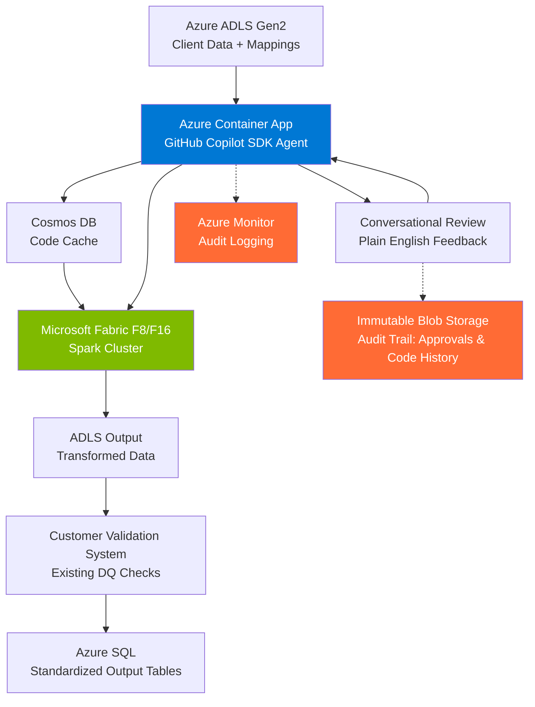

# AI Data Engineering Agent - Design Document

**Version:** 1.2  
**Date:** January 26, 2026  
**Status:** Draft

---

## Problem Statement

### Current State

The customer manages data transformations for **3,000+ clients**, each with unique data formats and structures. Every client submits data files (1-10GB) that must be transformed into a standardized output format for downstream analytics and audit processes.

**Key Challenges:**

1. **Hundreds of Custom PySpark Notebooks**
   - Each client requires a unique transformation notebook
   - Manual development and maintenance per client
   - New client onboarding requires ~8 hours of data engineering work

2. **Manual, Error-Prone Process**
   - Data engineers manually analyze mapping spreadsheets
   - Write custom PySpark transformations for each client
   - Test and validate transformations
   - Cost: ~$800 per client transformation (8 hours @ $100/hour)

3. **Scale Challenge**
   - 3,000 clients × 4-6 engagements/year = ~18,000 transformations annually
   - Peak load during audit busy season (Feb-April): 1,000+ transformations/month
   - Cannot hire enough data engineers to scale manually

4. **Maintenance Burden**
   - Client schema changes require notebook updates
   - Difficult to track which transformations are current
   - Risk of using outdated transformation logic

### Business Impact

**Current Manual Process Costs:**
- **New client onboarding:** ~8 hours data engineering + business analysis per client
- **Schema change updates:** ~4-6 hours to modify existing transformations
- **Pure reruns (no changes):** ~30 minutes manual validation + Spark execution

**Volume Breakdown (Typical Year):**
- New clients: ~5-10% of annual volume
- Schema changes: ~10-20% of annual volume  
- Pure reruns: ~70-80% of annual volume (quarterly runs with unchanged schemas)

**Cost Impact:**
- **Scalability bottleneck:** Cannot handle thousands of transformations without proportional headcount
- **Slow onboarding:** 8-hour setup delays time-to-value for new clients
- **Maintenance burden:** Schema changes require manual rework
- **Compliance risk:** Manual processes increase audit trail complexity

---

## Proposed Solution

### High-Level Approach

Build an **AI-powered data engineering agent** that automates the transformation development process while keeping humans in the loop for validation and approval.

**Solution Overview:**
1. **AI Agent** analyzes mapping spreadsheets and data samples to generate transformation logic
2. **Human Review** approves pseudocode descriptions via conversational feedback
3. **Automated Execution** generates and runs PySpark on Microsoft Fabric
4. **Intelligent Caching** reuses transformations when client schema unchanged

**Key Benefits:**
- **New client onboarding:** Reduce from 8 hours to 30 minutes (94% time reduction)
- **Schema changes:** Reduce from 4-6 hours to 30 minutes (agent regenerates transformations)
- **Pure reruns:** Reduce from 30 minutes to 15 minutes (cache hit, no AI analysis needed)
- **Cost optimization:** Automated process + intelligent caching significantly reduces manual effort
- **Scalability:** Handle thousands of transformations without linear headcount growth
- **Compliance:** Maintain human oversight with complete audit trail

---

## High-Level Architecture

### Architecture Diagram



### Services & Components

| Component | Service | Purpose |
|-----------|---------|---------|
| **AI Agent** | Azure Container Apps + GitHub Copilot SDK | Analyze mappings, generate transformations, orchestrate workflow |
| **Data Storage** | Azure ADLS Gen2 | Store client data, mappings, and output |
| **Big Data Processing** | Microsoft Fabric (Spark) | Execute PySpark transformations at scale (1-10GB files) |
| **Code Cache** | Cosmos DB | Store approved transformations for reuse |
| **Audit Logging** | Azure Monitor + Immutable Blob Storage | Compliance trail for regulatory requirements |
| **Validation** | Customer's Existing System | Data quality checks (completeness, accuracy) |

### Architecture Flow

**Phase 1: Analysis (AI-Powered)**
1. Agent checks Cosmos DB cache using hash(client_id + mapping + schema)
2. **Cache Hit**: Retrieve existing PySpark → Skip to Phase 3
3. **Cache Miss**: Parse mapping spreadsheet, sample 100 rows from data, generate pseudocode

**Phase 2: Human Review (Conversational)**
4. Display transformation pseudocode to user
5. User provides plain English feedback (e.g., "Add validation for negative values")
6. Agent iterates on pseudocode until user approves
7. Log approval action to immutable storage (compliance requirement)

**Phase 3: Execution**
8. Agent generates production PySpark from approved pseudocode
9. Store in Cosmos DB cache for future runs
10. Submit job to Fabric Spark cluster (F8 or F16 capacity)
11. Spark processes 10GB data from ADLS, writes transformed output

**Phase 4: Validation**
12. Customer's existing deterministic validation system checks output
13. **If pass**: Load to Azure SQL (standardized output tables)
14. **If fail**: Feedback loop returns to Phase 2 for refinement

**Scale Targets:**
- Normal operations: 300-400 transformations/month
- Audit busy season: 1,000+ transformations/month
- Annual: ~18,000 transformations across 3,000 clients

---

## Detailed Design

### 1. AI Agent Core (GitHub Copilot SDK)

**Purpose:** Orchestrate the entire pipeline using AI-powered planning and code generation.

**Capabilities:**
- Analyze mapping spreadsheets and data samples
- Generate pseudocode descriptions
- Convert pseudocode to executable PySpark
- Manage multi-step workflows
- Stream progress updates

**Implementation:**


**Key Features:**
- Custom Tools: Data profiling, mapping parsing, validation
- Multi-Turn Conversations: Iterative refinement with human feedback
- Streaming: Real-time updates to review interface
- Context Management: Maintains state across analysis and generation phases

---

### 2. Authentication & Authorization

#### Container App → ADLS Access
**Method:** Azure Managed Identity with RBAC roles
- `Storage Blob Data Reader` - Read client data and mappings
- `Storage Blob Data Contributor` - Write output data

#### Container App → Fabric Access
**Method:** Managed Identity with Workspace Contributor role
- Submit Spark jobs via Fabric REST API
- Monitor job execution

#### Fabric → ADLS
- Native OneLake integration
- Can access external ADLS with workspace identity

---
- OR mount ADLS with service principal
- OR use notebook-scoped credentials

**Fabric:**
- Native OneLake integration (no extra config needed)
- Can also access external ADLS with workspace identity

---

### 3. Code Caching & Deterministic Re-runs

**Purpose:** Avoid regenerating transformations when input structure hasn't changed.

**Architecture:**

```
┌─────────────────────────────────────────────┐
│  Code Cache (Azure Storage / Cosmos DB)     │
│                                              │
│  Key: hash(client_id + mapping + schema)    │
│  Value: {                                    │
│    "pseudocode": "...",                      │
│    "pyspark_code": "...",                    │
│    "created_at": "2026-01-20T...",           │
│    "status": "approved",                     │
│    "execution_count": 42,                    │
│    "last_run_success": true                  │
│  }                                           │
└─────────────────────────────────────────────┘
```

**Cache Key Generation:**


**Cache Lookup Flow:**


**Cache Invalidation:**
- Manual invalidation via UI (user marks cache as stale)
- Automatic when mapping file changes
- Automatic when data schema changes beyond tolerance threshold
- Time-based expiry (optional, e.g., 90 days)

**Storage Options:**

| Option | Pros | Cons | Best For |
|--------|------|------|----------|
| **Azure Blob Storage** | Simple, cheap, good for large code | Requires custom indexing | Small to medium scale |
| **Cosmos DB** | Fast lookups, built-in indexing, TTL | Higher cost | Production at scale |
| **Azure Table Storage** | Low cost, simple key-value | Limited query capabilities | Small scale |

**Recommendation:** Start with Cosmos DB for production-grade caching with fast lookups.

---

### 4. Workflow Orchestration

**End-to-End Process:**

```
1. TRIGGER (Manual/Scheduled)
   ↓
2. READ mapping + SAMPLE data (Container App)
   ↓
3. GENERATE cache key
   ↓
4. CHECK cache
   ├─ HIT → Execute cached code ──────────────┐
   │                                          │
   └─ MISS → Continue to analysis            │
      ↓                                       │
5. AI AGENT analyzes                          │
   ↓                                          │
6. GENERATE pseudocode                        │
   ↓                                          │
7. HUMAN REVIEW (approval interface)          │
   ├─ REJECT → Loop back to step 5            │
   └─ APPROVE                                 │
      ↓                                       │
8. AI AGENT generates PySpark                 │
   ↓                                          │
9. SAVE to cache                              │
   ↓                                          │
10. SUBMIT job to Spark cluster ←────────────┘
    ↓
11. MONITOR execution
    ↓
12. VALIDATE output
    ↓
13. UPDATE cache with success/failure
    ↓
14. NOTIFY user (email/dashboard)
```

---

## Data Flow Examples

### Scenario 1: First-Time Client Onboarding

**Input:**
- Client ID: `NEWCLIENT_001`
- Mapping: `ADLS://mappings/NEWCLIENT_001/mapping_v1.xlsx`
- Data: `ADLS://data/NEWCLIENT_001/transactions.csv` (5GB)

**Steps:**
1. Container App reads mapping + samples first 100 rows
2. Generates cache key: `a8f3d9e2b1c4...` (no match in cache)
3. Copilot SDK agent analyzes and generates pseudocode:
   ```
   ## Transformation Plan
   
   Source: transactions.csv
   Target: standardized_transactions.parquet
   
   Mappings:
   - "Account Number" → "R_IDFUND" (string, no transform)
   - "Transaction Date" → "T_DATE" (convert MM/DD/YYYY → YYYY-MM-DD)
   - "Amount" → "T_AMOUNT" (decimal, multiply by 1000)
   ...
   ```
4. Human reviews and approves via web UI
5. Copilot SDK generates PySpark code
6. Code saved to cache with key `a8f3d9e2b1c4...`
7. Job submitted to Databricks
8. PySpark reads full 5GB from ADLS, transforms, writes output
9. Output: `ADLS://output/NEWCLIENT_001/standardized_transactions.parquet`

**Time:** ~30 minutes (10 min analysis + 5 min review + 15 min execution)

### Scenario 2: Repeat Run (No Changes)

**Input:**
- Client ID: `NEWCLIENT_001`
- Same mapping and data structure as Scenario 1

**Steps:**
1. Container App reads mapping + samples first 100 rows
2. Generates cache key: `a8f3d9e2b1c4...` (MATCH!)
3. Retrieves cached PySpark code
4. Skips analysis and review (goes straight to execution)
5. Job submitted to Databricks
6. Transformation runs

**Time:** ~15 minutes (execution only)

### Scenario 3: Client Changes Mapping

**Input:**
- Client ID: `NEWCLIENT_001`
- Mapping: `ADLS://mappings/NEWCLIENT_001/mapping_v2.xlsx` (updated)
- Data structure unchanged

**Steps:**
1. Container App reads mapping + samples data
2. Generates cache key: `b7e4c8a1f2d9...` (no match - different mapping)
3. Full analysis + review + code generation cycle
4. New cache entry created
5. Execution

**Time:** ~30 minutes (same as first-time)

---

## Security Considerations

1. **Secrets Management:**
   - Store all credentials in Azure Key Vault
   - Use managed identities wherever possible
   - Rotate service principal secrets regularly

2. **Data Access:**
   - Principle of least privilege (grant only necessary RBAC roles)
   - Audit all ADLS access
   - Encrypt data at rest and in transit

3. **Code Execution:**
   - Validate generated PySpark code before execution
   - Sandbox execution environment
   - Rate limit AI API calls

4. **Network Security:**
   - Container App in VNet with private endpoints
   - Firewall rules on ADLS and Spark clusters
   - No public internet access for data paths

---

## Monitoring & Observability

**Key Metrics:**
- Job success rate
- Average transformation time
- Cache hit rate
- AI token usage
- Human review time
- Data volume processed

**Logging:**
- Application Insights for Container App logs
- Spark cluster logs (Databricks/Fabric)
- Audit trail for all transformations
- Human review decisions

**Alerting:**
- Job failures
- High error rates
- Performance degradation
- Cost anomalies

---

## Cost Optimization

1. **Cache Hits:** Avoid regenerating transformations (saves AI tokens + analysis time)
2. **Right-Size Clusters:** Auto-scale based on data volume
3. **Spot Instances:** Use for non-critical workloads (Databricks)
4. **Data Sampling:** Only 100 rows for analysis (reduces processing)
5. **Batch Processing:** Group multiple clients in off-peak hours

---

## Future Enhancements

- **Auto-approve:** For low-risk transformations after building confidence
- **Incremental Processing:** Support CDC (Change Data Capture)
- **Multi-client Batching:** Process multiple clients in single job
- **ML Model Fine-tuning:** Train on successful transformations
- **Real-time Processing:** Support streaming data sources
- **Self-service Portal:** Allow clients to upload mappings directly

---

*This design will evolve as we learn from the POC and initial production deployments.*

