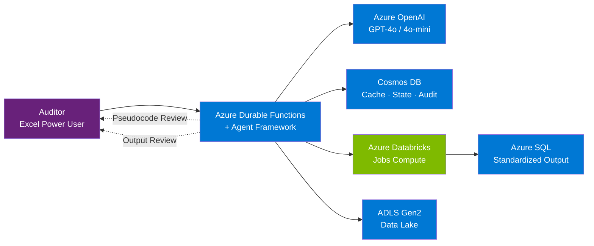
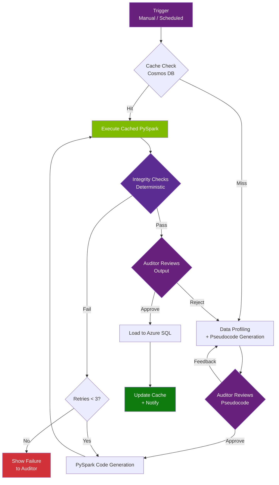
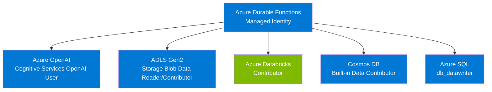
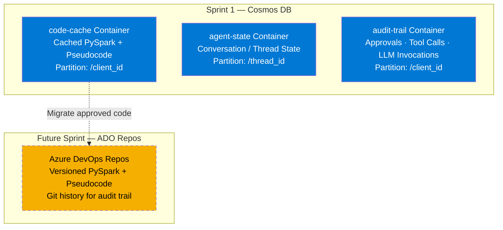
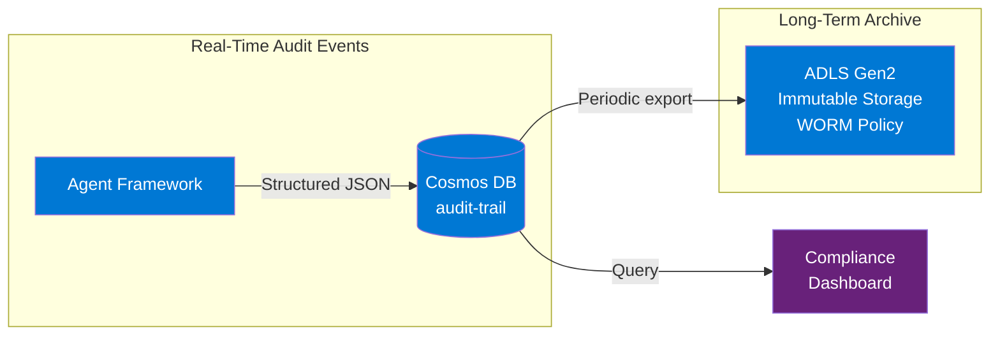

# AI Data Engineering Agent - Design Document

**Version:** 3.0
**Date:** February 6, 2026
**Status:** Draft

---

## Problem Statement

### Current State

The customer manages data transformations for **3,000+ clients**, each with unique data formats and structures. Every client submits data files (1-10GB) that must be transformed into a standardized output format (DNAV) for downstream audit processes.

**Current Roles:**
- **Auditors** — Conduct the actual audits using standardized data; Excel power users, not developers
- **Specialists** (support team) — Data engineers who write PySpark/Spark notebooks and handle data wrangling using tools like Omnia Data

**Business Sponsor Objective:** Make data engineering **self-service for auditors**, eliminating dependency on specialists. The AI agent replaces the specialist role — auditors provide the data dictionary and inputs, and the agent handles wrangling, with feedback loops for course correction.

**Key Challenges:**

1. **Hundreds of Custom Transformation Scripts**
   - Each client requires unique transformation logic
   - Currently maintained as Spark notebooks in Databricks + M code/Power Query
   - New client onboarding requires ~8 hours of specialist work

2. **Manual, Error-Prone Process**
   - Specialists manually analyze mapping spreadsheets
   - Write custom transformations for each client
   - Test and validate transformations
   - Cost: ~$800 per client transformation (8 hours @ $100/hour)

3. **Scale Challenge**
   - 3,000 clients × 5 engagements/year = ~15,000 transformations annually (~1,250/month)
   - Peak load during audit busy season (Feb-April): potentially higher
   - Cannot hire enough specialists to scale manually

4. **Maintenance Burden**
   - Client schema changes require script updates
   - Difficult to track which transformations are current
   - Risk of using outdated transformation logic

### Business Impact

**Current Manual Process Costs:**
- **New client onboarding:** ~8 hours data engineering + business analysis per client
- **Schema change updates:** ~4-6 hours to modify existing transformations
- **Pure reruns (no changes):** ~30 minutes manual validation + Spark execution

**Volume Breakdown (Typical Year):**
- New clients: ~5-10% of annual volume
- Schema changes: ~10-20% of annual volume
- Pure reruns: ~70-80% of annual volume (quarterly runs with unchanged schemas)

**Cost Impact:**
- **Scalability bottleneck:** Cannot handle thousands of transformations without proportional headcount
- **Slow onboarding:** 8-hour setup delays time-to-value for new clients
- **Maintenance burden:** Schema changes require manual rework
- **Compliance risk:** Manual processes increase audit trail complexity

---

## Proposed Solution

### High-Level Approach

Build an **AI-powered data engineering agent** that automates the transformation development process while keeping humans in the loop for validation and approval.

**Solution Overview:**
1. **AI Agent** analyzes mapping spreadsheets and data samples to generate transformation logic
2. **Human Review** approves pseudocode descriptions via conversational feedback
3. **Automated Execution** generates and runs PySpark on Azure Databricks
4. **Intelligent Caching** reuses transformations when client schema unchanged

**Key Benefits:**
- **New client onboarding:** Reduce from 8 hours to 30 minutes (94% time reduction)
- **Schema changes:** Reduce from 4-6 hours to 30 minutes (agent regenerates transformations)
- **Pure reruns:** Reduce from 30 minutes to 15 minutes (cache hit, no AI analysis needed)
- **Cost optimization:** Automated process + intelligent caching significantly reduces manual effort
- **Scalability:** Handle thousands of transformations without linear headcount growth
- **Compliance:** Maintain human oversight with complete audit trail

---

## High-Level Architecture

### Architecture Diagram



### Customer Tech Stack

The customer's existing platform uses the following services. To minimize tech debt and align with CTO guardrails, we design around these:

| Existing Service | Role in Current Platform |
|-----------------|------------------------|
| **.NET** | Application platform |
| **Azure SQL** | Primary database |
| **Azure Service Bus** | Async messaging / transactions |
| **Azure Functions (Durable)** | Compute / long-running workflows |
| **AKS** | Container orchestration |
| **Azure Databricks** | Spark notebooks (existing) |
| **ADLS Gen2** | Data lake storage |

**Compute Decision:** The agent runtime uses **Azure Durable Functions**. Durable Functions provides native durable orchestration for human-in-the-loop workflows — the agent pauses at review checkpoints and resumes when the auditor responds, with state automatically persisted. This is already in the customer's approved tech stack and avoids introducing new services (per CTO guardrails). Azure Container Apps is noted as a future roadmap option as Microsoft invests in AI Foundry integration, but is not required for initial deployment.

### Services & Components

| Component | Service | Purpose |
|-----------|---------|---------|
| **AI Agent Runtime** | Azure Durable Functions + Microsoft Agent Framework | Orchestrate workflow, manage agent lifecycle, tool calling, checkpointing |
| **LLM Backend** | Azure OpenAI (GPT-4o / GPT-4o-mini) | Data analysis, pseudocode generation, PySpark code generation |
| **Data Storage** | Azure ADLS Gen2 | Store client data, mappings, and output |
| **Big Data Processing** | Azure Databricks (Jobs Compute) | Execute PySpark transformations at scale (1-10GB files) |
| **Code Cache + Agent State + Audit** | Cosmos DB (serverless) | Runtime cache, agent conversation state, structured audit trail |
| **Approved Code Repository** | Cosmos DB (Sprint 1) / ADO Repos (future sprint) | PySpark + pseudocode storage; ADO Repos deferred due to auth complexity from Durable Functions |
| **Audit Archive** | ADLS Gen2 (immutable storage policy) | WORM-protected archive of code snapshots, execution logs, and approvals for legal hold |
| **Integrity Checks** | Agent-driven (deterministic scripts) | Automated validation of output before surfacing to human reviewer |

### Agent Workflow Overview



### Architecture Flow

**Phase 1: Cache Check**
1. Agent receives trigger (manual or scheduled) with client_id and mapping path
2. Agent checks Cosmos DB cache using `hash(client_id + mapping_content + schema_fingerprint)`
3. **Cache Hit**: Retrieve existing approved PySpark → Skip to Phase 4 (Execution)
4. **Cache Miss**: Continue to Phase 2

**Phase 2: Data Profiling & Pseudocode Generation (AI-Powered)**
5. Agent reads mapping spreadsheet from ADLS (via custom tool)
6. Agent samples first 100 rows from source data on ADLS (via custom tool)
7. Agent profiles the data: column types, null rates, value distributions, anomalies
8. Agent generates transformation pseudocode in plain English based on mapping + profile
9. Agent presents pseudocode to human reviewer for approval

**Phase 3: Human Review of Pseudocode (Conversational)**
10. Human reviewer sees pseudocode description (not PySpark — plain English)
11. Reviewer provides feedback in plain English (e.g., "Account numbers should be zero-padded to 10 digits")
12. Agent iterates on pseudocode incorporating feedback
13. Reviewer approves final pseudocode
14. Approval logged to Cosmos DB audit trail and archived to ADLS immutable storage
15. Agent workflow checkpoints state (Durable Functions built-in checkpointing)

**Phase 4: Code Generation & Execution (with Retry Logic)**
16. Agent generates production PySpark code from approved pseudocode
17. Store PySpark + pseudocode in Cosmos DB cache
18. Agent submits Spark job to Azure Databricks (Jobs Compute cluster)
19. Spark reads full dataset from ADLS, applies transformations, writes output to ADLS
20. **If execution fails**: Pass error log back to agent → agent diagnoses and fixes PySpark → re-submit (retry up to 3 times)

**Phase 5: Agent Self-Verification (Integrity Checks — Deterministic)**
21. Reviewer script (deterministic, not AI) runs automated integrity checks on the output:
    - **Row count validation**: Output rows vs. expected count from source
    - **Schema conformance**: All required columns present with correct types
    - **Null check**: No unexpected nulls in required fields
    - **Value range validation**: Numeric fields within expected bounds
    - **Referential integrity**: Foreign key relationships preserved
    - **Sample comparison**: Spot-check transformed values against source + mapping rules
22. **If checks fail**: Pass error log back to agent → agent diagnoses the issue, regenerates/fixes PySpark, re-executes (loop back to step 16, up to 3 total tries)
23. **If both execution AND checks pass**: Continue to Phase 6
24. **If fails after 3 tries**: Show failure message to auditor with error details

**Phase 6: Human Final Review (Auditor Reviews Output)**
25. Agent presents results to auditor **only after all integrity checks pass**:
    - Summary of transformation (row counts, column mappings applied)
    - Integrity check report (all checks passed)
    - Sample of transformed output (first N rows)
26. Auditor reviews the **output data** (not the PySpark code — auditors are Excel users, not developers)
27. **If output is acceptable**: Auditor approves → approval logged to Cosmos DB audit trail and ADLS immutable archive
28. **If output is not acceptable**: Auditor provides feedback → **loop back to Phase 3 (pseudocode revision)** → agent revises pseudocode → regenerates code → re-executes. The entire pipeline (Phases 3-6) is repeatable.
29. On final approval: Output loaded to Azure SQL (standardized output tables)
30. Cache entry updated with success status and execution metadata

**Scale Targets:**
- Normal operations: ~1,250 transformations/month (3,000 clients × 5 runs/year ÷ 12)
- Audit busy season (Feb-April): potentially higher
- Annual: ~15,000 transformations across 3,000 clients

---

## Detailed Design

### 1. AI Agent Runtime (Microsoft Agent Framework)

**Purpose:** Orchestrate the entire pipeline using AI-powered planning, tool calling, and code generation.

**Why Microsoft Agent Framework (not GitHub Copilot SDK):**
- GitHub Copilot SDK remains in preview with uncertain GA timeline — too risky for customer's production deadline
- Agent Framework merges AutoGen + Semantic Kernel into a single production-grade SDK
- Azure AI Foundry Agent Service (hosted runtime) is already GA as of May 2025
- Agent Framework Python SDK in public preview, GA targeted Q1 2026
- No platform fee — pure consumption pricing via Azure OpenAI
- 10,000+ organizations already using Foundry Agent Service in production (KPMG, BMW, Commerzbank)
- Native workflow checkpointing for human-in-the-loop approval flows
- MCP (Model Context Protocol) support for custom tools
- **Note:** Agent Framework can wrap Copilot SDK as a backend agent type (`GitHubCopilotAgent`) if Copilot SDK reaches GA later — migration path preserved

**Implementation Pattern:**

```python
from agent_framework.azure import AzureOpenAIResponsesClient
from agent_framework import ChatAgent, MCPStdioTool
from azure.identity import DefaultAzureCredential

# Initialize with Managed Identity (no API keys)
client = AzureOpenAIResponsesClient(
    credential=DefaultAzureCredential(),
    azure_endpoint="https://<resource>.openai.azure.com",
    model="gpt-4o",
)

# Create the data engineering agent
agent = client.as_agent(
    name="DataEngineeringAgent",
    instructions="""You are a data engineering agent that:
    1. Profiles source data on ADLS
    2. Analyzes mapping spreadsheets
    3. Generates transformation pseudocode for human review
    4. Converts approved pseudocode to PySpark
    5. Validates output integrity before presenting to reviewer
    """,
)

# Attach custom MCP tools for ADLS data access
async with (
    MCPStdioTool(name="adls-tools", command="python", args=["mcp_adls_server.py"]) as adls,
    MCPStdioTool(name="databricks-tools", command="python", args=["mcp_databricks_server.py"]) as databricks,
    agent,
):
    result = await agent.run(
        "Profile the data at adls://data/CLIENT_001/transactions.csv "
        "and analyze the mapping at adls://mappings/CLIENT_001/mapping_v1.xlsx",
        tools=[adls, databricks],
    )
```

**Key Capabilities:**
- **Custom Tools via MCP**: Data profiling, mapping parsing, Spark job submission, integrity checks (stdio, HTTP, or WebSocket transports)
- **Workflow Checkpointing**: Pause for human approval, persist state to Cosmos DB, resume after review
- **Multi-Turn Conversations**: Iterative pseudocode refinement with human feedback
- **Streaming**: Real-time progress via `run_stream()` and `AgentRunUpdateEvent`
- **Agent State Persistence**: Conversation history stored in Cosmos DB (`ChatMessageStore`)
- **Model Flexibility**: Swap between GPT-4o (complex analysis), GPT-4o-mini (simple tasks) without code changes

**Custom MCP Tools (to be built):**

| Tool | Purpose | Phase Used |
|------|---------|------------|
| `read_mapping_spreadsheet` | Parse Excel mapping file from ADLS | Phase 2 |
| `sample_source_data` | Read first N rows from source file on ADLS | Phase 2 |
| `profile_data` | Column types, null rates, distributions, anomalies | Phase 2 |
| `submit_spark_job` | Submit PySpark to Databricks via Jobs API | Phase 4 |
| `check_spark_job_status` | Poll Databricks job completion | Phase 4 |
| `read_spark_output` | Read output data for validation | Phase 5 |
| `run_integrity_checks` | Row counts, schema, nulls, ranges, referential integrity | Phase 5 |
| `write_to_cache` | Store approved code in Cosmos DB | Phase 4 |
| `read_from_cache` | Retrieve cached transformations | Phase 1 |
| `commit_to_ado_repo` | Commit approved PySpark + pseudocode to ADO Repos | **(Future Sprint)** |

---

### 2. Authentication & Authorization

All authentication uses **Azure Managed Identity** — no API keys or secrets in code.



#### Agent Runtime → Azure OpenAI
**Method:** Managed Identity with `Cognitive Services OpenAI User` RBAC role
- Agent Framework uses `DefaultAzureCredential` — automatically picks up managed identity from Function App identity
- No API key management required

#### Agent Runtime → ADLS Access
**Method:** Managed Identity with RBAC roles
- `Storage Blob Data Reader` - Read client data and mappings
- `Storage Blob Data Contributor` - Write output data

#### Agent Runtime → Databricks Access
**Method:** Managed Identity with Contributor role on Databricks workspace
- Submit Spark jobs via Databricks Jobs API
- Monitor job execution

#### Agent Runtime → Cosmos DB
**Method:** Managed Identity with `Cosmos DB Built-in Data Contributor` role
- Read/write code cache entries
- Store agent thread/conversation state (Agent Framework `ChatMessageStore`)
- Write structured audit trail events

#### Agent Runtime → Azure SQL
**Method:** Managed Identity with `db_datawriter` role
- Load final approved output to standardized tables

#### Future Sprint: Agent Runtime → Azure DevOps Repos
> **Deferred to future sprint.** Authenticating from Durable Functions to ADO Repos requires a service principal with PAT or OAuth app registration — more complex than Managed Identity. Sprint 1 uses Cosmos DB as the sole code store. ADO Repos integration will be added once the core pipeline is proven.

**Method (when implemented):** Service principal with `Contributor` role on the code repository
- Commit approved PySpark code to designated repo
- Create branches/PRs for audit trail

#### Databricks → ADLS
- Mount ADLS via service principal or Unity Catalog external location
- Or use notebook-scoped credentials with Managed Identity passthrough

---

### 3. Code Storage & Caching

**Purpose:** Avoid regenerating transformations when input structure hasn't changed, while maintaining a versioned audit trail of all approved code.

#### Sprint 1: Cosmos DB as Single Store

In Sprint 1, **Cosmos DB serves as both the runtime cache and the code repository**. This simplifies the architecture and avoids the auth complexity of integrating Durable Functions with ADO Repos.



#### Cosmos DB Container Schema

| Container | Purpose | Partition Key | TTL |
|-----------|---------|--------------|-----|
| `code-cache` | Cached PySpark + pseudocode, execution metadata | `/client_id` | Optional (90 days) |
| `agent-state` | Conversation history, thread state, checkpoints | `/thread_id` | 30 days after last activity |
| `audit-trail` | Approvals, tool calls, LLM invocations, execution results | `/client_id` | None (retained indefinitely) |

**`code-cache` document example:**
```json
{
  "id": "a8f3d9e2b1c4...",
  "client_id": "CLIENT_001",
  "cache_key": "hash(client_id + mapping_content + schema_fingerprint)",
  "pseudocode": "...",
  "pyspark_code": "...",
  "created_at": "2026-01-20T...",
  "status": "approved",
  "execution_count": 42,
  "last_run_success": true
}
```

**`audit-trail` document example:**
```json
{
  "id": "evt_20260120_001",
  "client_id": "CLIENT_001",
  "event_type": "pseudocode_approval",
  "timestamp": "2026-01-20T14:32:00Z",
  "actor": "auditor@customer.com",
  "details": {
    "pseudocode_version": 2,
    "feedback_rounds": 1,
    "cache_key": "a8f3d9e2b1c4..."
  }
}
```

#### Future Sprint: ADO Repos Integration

The customer's TK requires that "all the codes should go to repos" for audit trail. We honor that goal with a phased approach:

- **Sprint 1:** Cosmos DB stores all code, state, and audit data. Code versioning handled via cache key + `created_at` timestamps.
- **Future Sprint:** Agent commits approved PySpark + pseudocode to ADO Repos via `commit_to_ado_repo` MCP tool. Cosmos DB remains the runtime cache; ADO Repos becomes the system of record for approved code.

**ADO Repos Workflow (future):**
- Agent commits approved code via automated PR (no manual code review required — auditor already approved the pseudocode/output)
- Each client gets a directory with versioned pseudocode + PySpark
- Commit message includes: client_id, approver, transformation hash, timestamp
- Branch strategy TBD: direct commits to main vs. per-client branches

**Cache Lookup Flow:**
1. Generate key: `hash(client_id + mapping_content + schema_fingerprint)`
2. Check Cosmos DB `code-cache` container
3. **Cache Hit**: Retrieve PySpark code → skip AI processing → execute on Spark
4. **Cache Miss**: Full pipeline (profile → pseudocode → review → code gen)
5. On approval: Write to Cosmos DB `code-cache` + log event to `audit-trail`

**Cache Invalidation:**
- Manual invalidation via UI (user marks cache as stale)
- Automatic when mapping file changes
- Automatic when data schema changes beyond tolerance threshold
- Time-based expiry (optional, e.g., 90 days)

---

### 4. Workflow Orchestration

**End-to-End Process:**

```
1.  TRIGGER (Manual/Scheduled)
    ↓
2.  READ mapping + SAMPLE data (Agent Runtime / MCP tools)
    ↓
3.  GENERATE cache key: hash(client_id + mapping_content + schema_fingerprint)
    ↓
4.  CHECK cache (Cosmos DB code-cache)
    ├─ HIT → Execute cached PySpark ──────────────────────────────┐
    │                                                             │
    └─ MISS → Continue to profiling                               │
       ↓                                                          │
5.  PROFILE data (column types, nulls, distributions, anomalies)  │
    ↓                                                             │
6.  GENERATE pseudocode (plain English transformation plan)       │
    ↓                                                             │
7.  AUDITOR REVIEW of pseudocode (conversational)                 │
    ├─ FEEDBACK → Agent revises pseudocode (loop back to 6)       │
    └─ APPROVE → Log to Cosmos DB audit-trail + ADLS archive      │
       ↓                                                          │
8.  CHECKPOINT state (Durable Functions persistence)              │
    ↓                                                             │
9.  GENERATE PySpark from approved pseudocode                     │
    ↓                                                             │
10. SAVE to Cosmos DB code-cache                                  │
    ↓                                                             │
11. SUBMIT Spark job to Databricks ←──────────────────────────────┘
    ↓
12. MONITOR execution (poll Databricks Jobs API)
    ↓
13. EXECUTION SUCCEEDED?
    ├─ NO  → Pass error log to agent → fix PySpark → re-submit
    │        (retry up to 3 times, then fail to auditor)
    └─ YES → Continue
       ↓
14. REVIEWER SCRIPT (deterministic integrity checks):
    ├─ Row count validation
    ├─ Schema conformance
    ├─ Null checks on required fields
    ├─ Value range validation
    ├─ Referential integrity
    └─ Sample spot-check against mapping rules
    ↓
15. CHECKS PASS?
    ├─ NO  → Pass error log to agent → fix PySpark → re-execute
    │        (combined retries: max 3 total across steps 13+15)
    └─ YES → Continue
       ↓
16. AUDITOR FINAL REVIEW (reviews OUTPUT, not code):
    ├─ Transformation summary
    ├─ Integrity check report
    └─ Sample output rows
    ↓
17. AUDITOR APPROVES OUTPUT?
    ├─ NO  → Feedback → LOOP BACK TO STEP 6 (revise pseudocode)
    │        Entire pipeline 6→17 is repeatable
    └─ YES → Log to Cosmos DB audit-trail + ADLS archive
       ↓
18. LOAD to Azure SQL (standardized output tables)
    ↓
19. UPDATE cache with success metadata
    ↓
20. NOTIFY auditor (email/dashboard)
```

**Workflow Checkpointing:**

Azure Durable Functions provides built-in workflow checkpointing, which is critical for our human-in-the-loop approval flow. At steps 7 and 16, the agent workflow pauses and persists its full state (conversation history, generated artifacts, current phase) to Cosmos DB. When the auditor returns with approval or feedback, the workflow resumes from the exact checkpoint without re-running prior steps.

```python
from agent_framework.workflows import Workflow, checkpoint

MAX_RETRIES = 3

class TransformationWorkflow(Workflow):
    async def run(self, client_id: str, mapping_path: str):
        # Phase 2: Profile + generate pseudocode
        pseudocode = await self.agent.run(f"Profile and generate pseudocode for {client_id}")

        # Outer loop: auditor can reject output and revise pseudocode
        while True:
            # Phase 3: Pause for auditor review of pseudocode
            approval = await checkpoint("pseudocode_review", {
                "pseudocode": pseudocode,
                "client_id": client_id,
            })

            if not approval.approved:
                pseudocode = await self.agent.run(f"Revise pseudocode: {approval.feedback}")
                continue  # Re-checkpoint for another review

            # Phase 4-5: Generate, execute, validate (with retry logic)
            for attempt in range(MAX_RETRIES):
                pyspark_code = await self.agent.run(f"Generate PySpark from: {pseudocode}")
                execution_result = await self.execute_spark_job(pyspark_code)

                if not execution_result.success:
                    # Pass error log back to agent for diagnosis
                    pyspark_code = await self.agent.run(
                        f"Fix PySpark code. Error log: {execution_result.error_log}"
                    )
                    continue

                # Run deterministic integrity checks (reviewer script)
                check_result = await self.run_integrity_checks(execution_result.output)
                if check_result.passed:
                    break
                # Pass check failures back to agent
                pyspark_code = await self.agent.run(
                    f"Fix PySpark code. Integrity check failures: {check_result.errors}"
                )
            else:
                # After 3 failures, show error to auditor
                await checkpoint("failure_review", {"error": "Max retries exceeded"})
                return

            # Phase 6: Pause for auditor final review (output, not code)
            final_approval = await checkpoint("final_review", {
                "integrity_report": check_result,
                "sample_output": sample_rows,
            })

            if final_approval.approved:
                break  # Success — proceed to load
            else:
                # Auditor rejected output → revise pseudocode
                pseudocode = await self.agent.run(
                    f"Revise pseudocode based on output feedback: {final_approval.feedback}"
                )
                # Loop back to pseudocode review
```

---

## Data Flow Examples

### Scenario 1: First-Time Client Onboarding

**Input:**
- Client ID: `NEWCLIENT_001`
- Mapping: `ADLS://mappings/NEWCLIENT_001/mapping_v1.xlsx`
- Data: `ADLS://data/NEWCLIENT_001/transactions.csv` (5GB)

**Steps:**
1. Agent reads mapping spreadsheet from ADLS (via `read_mapping_spreadsheet` MCP tool)
2. Agent samples first 100 rows from source data (via `sample_source_data` MCP tool)
3. Generates cache key: `a8f3d9e2b1c4...` (no match in cache)
4. Agent profiles the data: identifies column types, null patterns, value distributions
5. Agent generates pseudocode transformation plan:
   ```
   ## Transformation Plan

   Source: transactions.csv (5GB, 12M rows)
   Target: standardized_transactions.parquet

   Data Profile:
   - 15 columns, 0 completely null columns
   - "Transaction Date" has 3 formats detected (MM/DD/YYYY, YYYY-MM-DD, DD-Mon-YY)
   - "Amount" range: -50,000 to 999,999 (1.2% negative values)

   Mappings:
   - "Account Number" → "R_IDFUND" (string, zero-pad to 10 digits)
   - "Transaction Date" → "T_DATE" (normalize all formats → YYYY-MM-DD)
   - "Amount" → "T_AMOUNT" (decimal, multiply by 1000, flag negatives)
   ...
   ```
6. Human reviewer approves pseudocode (or provides feedback for iteration)
7. Agent generates PySpark code from approved pseudocode
8. Code saved to Cosmos DB cache with key `a8f3d9e2b1c4...`
9. Spark job submitted to Azure Databricks
10. PySpark reads full 5GB from ADLS, transforms, writes output
11. Agent runs integrity checks: row count matches (12M in, 12M out), schema valid, no unexpected nulls
12. Agent presents results + integrity report to human for final approval
13. Output: `ADLS://output/NEWCLIENT_001/standardized_transactions.parquet`

**Time:** ~30 minutes (10 min profiling + analysis, 5 min pseudocode review, 10 min execution + checks, 5 min final review)

### Scenario 2: Repeat Run (No Changes)

**Input:**
- Client ID: `NEWCLIENT_001`
- Same mapping and data structure as Scenario 1

**Steps:**
1. Agent reads mapping + samples first 100 rows
2. Generates cache key: `a8f3d9e2b1c4...` (MATCH!)
3. Retrieves cached PySpark code from Cosmos DB
4. Skips profiling, pseudocode, and human review (straight to execution)
5. Spark job submitted to Databricks
6. Transformation runs
7. Agent runs integrity checks on output (automated)
8. **If checks pass**: Output loaded directly (no human review needed for cache hits with passing checks)

**Time:** ~15 minutes (execution + automated checks only)

### Scenario 3: Client Changes Mapping

**Input:**
- Client ID: `NEWCLIENT_001`
- Mapping: `ADLS://mappings/NEWCLIENT_001/mapping_v2.xlsx` (updated)
- Data structure unchanged

**Steps:**
1. Agent reads mapping + samples data
2. Generates cache key: `b7e4c8a1f2d9...` (no match — different mapping)
3. Full cycle: profiling → pseudocode → human review → code gen → execution → integrity checks → final review
4. New cache entry created in Cosmos DB
5. Old cache entry preserved (mapping_v1 key still valid if client reverts)

**Time:** ~30 minutes (same as first-time onboarding)

---

## Security Considerations

1. **Secrets Management:**
   - Store all credentials in Azure Key Vault
   - Use managed identities wherever possible
   - Rotate service principal secrets regularly

2. **Data Access:**
   - Principle of least privilege (grant only necessary RBAC roles)
   - Audit all ADLS access
   - Encrypt data at rest and in transit

3. **Code Execution:**
   - Validate generated PySpark code before execution
   - Sandbox execution environment
   - Rate limit AI API calls

4. **Network Security:**
   - Agent runtime in VNet with private endpoints (Function App VNet integration)
   - Firewall rules on ADLS and Spark clusters
   - No public internet access for data paths

---

## Audit & Compliance

### Audit Architecture



### Structured Audit Events (Cosmos DB)

Every agent action is logged as a structured JSON event in the `audit-trail` Cosmos DB container. These events are queryable for compliance dashboards and reporting.

**Event types logged:**
- `pseudocode_approval` — Auditor approved/rejected pseudocode (who, when, feedback)
- `output_approval` — Auditor approved/rejected output (who, when, feedback)
- `llm_invocation` — Every LLM call (model, token counts, prompt hash — no client data)
- `tool_call` — Every MCP tool invocation (tool name, parameters, result status)
- `spark_execution` — Job submission, completion, duration, success/failure
- `integrity_check` — Deterministic check results (pass/fail per check type)
- `cache_hit` / `cache_miss` — Cache lookup results

### Immutable Archive (ADLS Gen2)

For legal hold and long-term retention, audit data is periodically exported from Cosmos DB to ADLS Gen2 with an **immutable storage policy (WORM)**:

- **Code snapshots**: PySpark + pseudocode at time of approval
- **Execution logs**: Spark job logs, integrity check results
- **Approval records**: Full approval chain with timestamps and actor identities
- **Retention**: Configurable per compliance requirements (e.g., 7 years)

### Key Metrics

- Job success rate
- Average transformation time
- Cache hit rate
- AI token usage
- Human review time
- Data volume processed

### Alerting

- Job failures (via Azure Functions monitoring)
- High error rates
- Performance degradation
- Cost anomalies

---

## Cost Optimization

1. **Cache Hits:** Avoid regenerating transformations (saves AI tokens + Spark compute time)
2. **Right-Size Clusters:** Databricks autoscaling (1-5 workers) based on data volume
3. **Spot Instances:** 40-80% discount on Databricks worker VMs for non-critical jobs
3. **Model Tiering:** Use GPT-4o-mini for simple tasks (profiling, cache lookups), GPT-4o for complex analysis (pseudocode, PySpark generation)
4. **Data Sampling:** Only 100 rows for analysis (reduces processing and LLM token costs)
5. **Batch Processing:** Group multiple clients in off-peak hours

---

## Future Enhancements

- **ADO Repos Integration:** Commit approved PySpark + pseudocode to Azure DevOps Repos for git-based version history (deferred from Sprint 1 due to Durable Functions → ADO auth complexity)
- **Auto-approve:** For low-risk transformations after building confidence
- **Incremental Processing:** Support CDC (Change Data Capture)
- **Multi-client Batching:** Process multiple clients in single job
- **ML Model Fine-tuning:** Train on successful transformations
- **Real-time Processing:** Support streaming data sources
- **Self-service Portal:** Allow clients to upload mappings directly

---

*This design will evolve as we learn from the POC and initial production deployments.*
