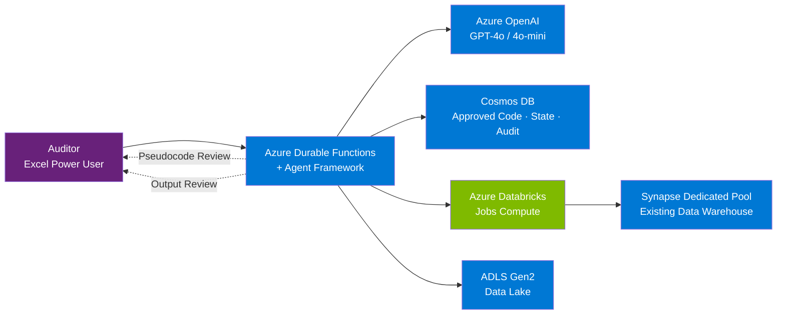
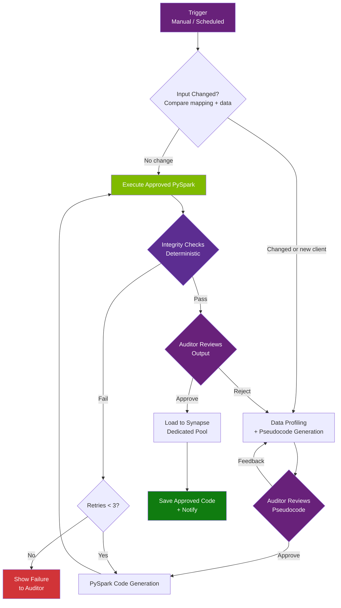
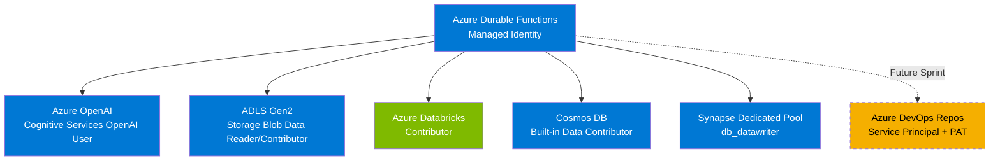
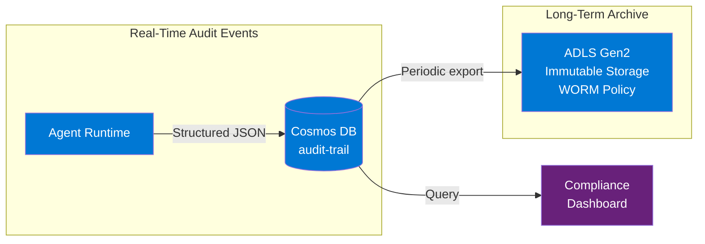

# AI Data Engineering Agent - Design Document

**Version:** 3.0
**Date:** February 6, 2026
**Status:** Draft

---

## Problem Statement

### Current State

The customer manages data transformations for **3,000+ clients**, each with unique data formats and structures. Every client submits data files (1-10GB) that must be transformed into a standardized output format (DNAV) for downstream audit processes.

**Current Roles:**
- **Auditors** — Conduct the actual audits using standardized data; Excel power users, not developers
- **Specialists** (support team) — Data engineers who write PySpark/Spark notebooks and handle data wrangling using tools like Omnia Data

**Business Sponsor Objective:** Make data engineering **self-service for auditors**, eliminating dependency on specialists. The AI agent replaces the specialist role — auditors provide the data dictionary and inputs, and the agent handles wrangling, with feedback loops for course correction.

**Key Challenges:**

1. **Hundreds of Custom Transformation Scripts**
   - Each client requires unique transformation logic
   - Currently maintained as Spark notebooks in Databricks + M code/Power Query
   - New client onboarding requires ~8 hours of specialist work

2. **Manual, Error-Prone Process**
   - Specialists manually analyze mapping spreadsheets
   - Write custom transformations for each client
   - Test and validate transformations
   - Cost: ~$800 per client transformation (8 hours @ $100/hour)

3. **Scale Challenge**
   - 3,000 clients × 5 engagements/year = ~15,000 transformations annually (~1,250/month)
   - Peak load during audit busy season (Feb-April): potentially higher
   - Cannot hire enough specialists to scale manually

4. **Maintenance Burden**
   - Client schema changes require script updates
   - Difficult to track which transformations are current
   - Risk of using outdated transformation logic

### Business Impact

**Current Manual Process Costs:**
- **New client onboarding:** ~8 hours data engineering + business analysis per client
- **Schema change updates:** ~4-6 hours to modify existing transformations
- **Pure reruns (no changes):** ~30 minutes manual validation + Spark execution

**Volume Breakdown (Typical Year):**
- New clients: ~5-10% of annual volume
- Schema changes: ~10-20% of annual volume
- Pure reruns: ~70-80% of annual volume (quarterly runs with unchanged schemas)

**Cost Impact:**
- **Scalability bottleneck:** Cannot handle thousands of transformations without proportional headcount
- **Slow onboarding:** 8-hour setup delays time-to-value for new clients
- **Maintenance burden:** Schema changes require manual rework
- **Compliance risk:** Manual processes increase audit trail complexity

---

## Proposed Solution

### High-Level Approach

Build an **AI-powered data engineering agent** that automates the transformation development process while keeping humans in the loop for validation and approval.

**Solution Overview:**
1. **AI Agent** analyzes mapping spreadsheets and data samples to generate transformation logic
2. **Human Review** approves pseudocode descriptions via conversational feedback
3. **Automated Execution** generates and runs PySpark on Azure Databricks
4. **Approved Code Reuse** skips AI processing when a client's inputs haven't changed

**Key Benefits:**
- **New client onboarding:** Reduce from 8 hours to 30 minutes (94% time reduction)
- **Schema changes:** Reduce from 4-6 hours to 30 minutes (agent regenerates transformations)
- **Pure reruns:** Reduce from 30 minutes to 15 minutes (approved code reuse, no AI analysis needed)
- **Cost optimization:** Automated process + code reuse significantly reduces manual effort
- **Scalability:** Handle thousands of transformations without linear headcount growth
- **Compliance:** Maintain human oversight with complete audit trail

---

## High-Level Architecture

### Architecture Diagram



### Customer Tech Stack

The customer's existing platform uses the following services. To minimize tech debt and align with CTO guardrails, we design around these:

| Existing Service | Role in Current Platform |
|-----------------|------------------------|
| **.NET** | Application platform |
| **Azure Synapse Analytics** | Dedicated SQL pool (existing data warehouse) |
| **Azure Service Bus** | Async messaging / transactions |
| **Azure Functions (Durable)** | Compute / long-running workflows |
| **AKS** | Container orchestration |
| **Azure Databricks** | Spark notebooks (existing) |
| **ADLS Gen2** | Data lake storage |

**Compute Decision:** The agent runtime uses **Azure Durable Functions**. Durable Functions provides native durable orchestration for human-in-the-loop workflows — the agent pauses at review checkpoints and resumes when the auditor responds, with state automatically persisted. This is already in the customer's approved tech stack and avoids introducing new services (per CTO guardrails).

**Output Destination:** Transformed data is loaded into the customer's existing **Azure Synapse Analytics dedicated SQL pool** (data warehouse). These are production tables already in use by downstream audit processes — the agent simply writes to them.

### Services & Components

| Component | Service | Purpose |
|-----------|---------|---------|
| **AI Agent Runtime** | Azure Durable Functions + Microsoft Agent Framework | Orchestrate workflow, manage agent lifecycle, tool calling, checkpointing |
| **LLM Backend** | Azure OpenAI (GPT-4o / GPT-4o-mini) | Data analysis, pseudocode generation, PySpark code generation |
| **Data Storage** | Azure ADLS Gen2 | Store client data, mappings, and intermediate output |
| **Big Data Processing** | Azure Databricks (Jobs Compute) | Execute PySpark transformations at scale (1-10GB files) |
| **Output Destination** | Azure Synapse Analytics (dedicated SQL pool) | Load transformed data into existing production tables |
| **Approved Code + Agent State + Audit** | Cosmos DB (serverless, 3 containers) | Per-client approved code, agent conversation state, structured audit trail |
| **Approved Code Repository** | Cosmos DB (Sprint 1) / ADO Repos (future sprint) | ADO Repos deferred due to Durable Functions → ADO auth complexity |
| **Audit Archive** | ADLS Gen2 (immutable storage policy) | WORM-protected archive for legal hold |
| **Integrity Checks** | Agent-driven (deterministic scripts) | Automated validation of output before surfacing to human reviewer |

---

## Agent Workflow

### Workflow Diagram



### Phase Descriptions

#### Phase 1: Input Change Detection

Agent receives a trigger (manual or scheduled) with a `client_id` and mapping file path.

1. Look up existing approved code for this `client_id` in Cosmos DB
2. If no approved code exists → this is a new client → proceed to Phase 2
3. If approved code exists, check whether inputs have changed:
   - **Mapping file**: Compare current file's SHA-256 against the stored `mapping_hash`
   - **Source data**: Compare current ADLS ETag against the stored `data_etag` (a single HEAD request — no data transfer, sub-second)
4. **No changes detected** → reuse approved PySpark → skip to Phase 4 (Execution)
5. **Changes detected** → proceed to Phase 2

---

#### Phase 2: Data Profiling & Pseudocode Generation

AI-powered analysis of the client's data and mapping.

1. Agent reads mapping spreadsheet from ADLS
2. Agent samples first 100 rows from source data on ADLS
3. Agent profiles the data: column types, null rates, value distributions, anomalies
4. Agent generates transformation pseudocode in plain English based on mapping + data profile
5. Agent presents pseudocode to auditor for review

---

#### Phase 3: Auditor Review of Pseudocode

Conversational review — the auditor sees plain English, not code.

1. Auditor sees pseudocode description (e.g., "Account Number → R_IDFUND, zero-pad to 10 digits")
2. Auditor provides feedback in plain English (e.g., "Account numbers should also strip leading spaces")
3. Agent iterates on pseudocode incorporating feedback — this loop repeats as needed
4. Auditor approves final pseudocode
5. Approval logged to Cosmos DB `audit-trail` and archived to ADLS immutable storage
6. Agent workflow checkpoints state (Durable Functions built-in)

---

#### Phase 4: Code Generation & Execution

Agent generates PySpark and runs it on Databricks with retry logic.

1. Agent generates production PySpark code from the approved pseudocode
2. PySpark + pseudocode saved to Cosmos DB as the client's approved code
3. Agent submits Spark job to Azure Databricks (Jobs Compute cluster)
4. Spark reads full dataset from ADLS, applies transformations, writes output to ADLS
5. **If execution fails**: Error log passed back to agent → agent diagnoses and fixes PySpark → re-submit (up to 3 total tries across Phase 4 + Phase 5)

---

#### Phase 5: Integrity Checks (Deterministic)

A reviewer script — not AI — runs automated validation on the output.

1. **Row count validation**: Output rows vs. expected count from source
2. **Schema conformance**: All required columns present with correct types
3. **Null check**: No unexpected nulls in required fields
4. **Value range validation**: Numeric fields within expected bounds
5. **Referential integrity**: Foreign key relationships preserved
6. **Sample comparison**: Spot-check transformed values against source + mapping rules
7. **If checks fail**: Error log passed back to agent → agent fixes PySpark → re-execute (loop to Phase 4 step 3, up to 3 total tries)
8. **If checks pass**: Proceed to Phase 6
9. **If fails after 3 tries**: Show failure message to auditor with error details

---

#### Phase 6: Auditor Final Review

Auditor reviews the output data — not the code.

1. Agent presents results to auditor **only after all integrity checks pass**:
   - Summary of transformation (row counts, column mappings applied)
   - Integrity check report (all checks passed)
   - Sample of transformed output (first N rows)
2. Auditor reviews the **output data** (auditors are Excel users, not developers)
3. **If output is acceptable**: Auditor approves → approval logged to Cosmos DB `audit-trail` and ADLS immutable archive
4. **If output is not acceptable**: Auditor provides feedback → **loop back to Phase 3 (pseudocode revision)** → agent revises pseudocode → regenerates code → re-executes. The entire pipeline (Phases 3-6) is repeatable.
5. On final approval: Output loaded to Synapse dedicated pool (existing production tables)
6. Approved code entry updated with success status and execution metadata

---

**Scale Targets:**
- Normal operations: ~1,250 transformations/month (3,000 clients × 5 runs/year ÷ 12)
- Audit busy season (Feb-April): potentially higher
- Annual: ~15,000 transformations across 3,000 clients

---

## Detailed Design

### 1. AI Agent Runtime (Microsoft Agent Framework)

**Purpose:** Orchestrate the entire pipeline using AI-powered planning, tool calling, and code generation.

**Why Microsoft Agent Framework (not GitHub Copilot SDK):**
- GitHub Copilot SDK remains in public preview with uncertain GA timeline — too risky for customer's production deadline
- Agent Framework provides native workflow checkpointing for human-in-the-loop approval flows
- No platform fee — consumption pricing via Azure OpenAI
- Migration path preserved: Agent Framework can wrap Copilot SDK as a backend agent type (`GitHubCopilotAgent`) if it reaches GA later

**Implementation Pattern:**

```python
from agent_framework.azure import AzureOpenAIResponsesClient
from agent_framework import ChatAgent, FunctionTool
from azure.identity import DefaultAzureCredential

# Initialize with Managed Identity (no API keys)
client = AzureOpenAIResponsesClient(
    credential=DefaultAzureCredential(),
    azure_endpoint="https://<resource>.openai.azure.com",
    model="gpt-4o",
)

# Define tools as direct functions
async def read_mapping_spreadsheet(path: str) -> dict:
    """Parse Excel mapping file from ADLS and return column mappings."""
    ...

async def sample_source_data(path: str, n_rows: int = 100) -> dict:
    """Read first N rows from source file on ADLS for profiling."""
    ...

async def submit_spark_job(pyspark_code: str, client_id: str) -> dict:
    """Submit PySpark job to Databricks via Jobs API."""
    ...

# Create the data engineering agent with direct function tools
agent = client.as_agent(
    name="DataEngineeringAgent",
    instructions="""You are a data engineering agent that:
    1. Profiles source data on ADLS
    2. Analyzes mapping spreadsheets
    3. Generates transformation pseudocode for human review
    4. Converts approved pseudocode to PySpark
    5. Validates output integrity before presenting to reviewer
    """,
    tools=[
        FunctionTool(read_mapping_spreadsheet),
        FunctionTool(sample_source_data),
        FunctionTool(submit_spark_job),
        # ... other tools
    ],
)

result = await agent.run(
    "Profile the data at adls://data/CLIENT_001/transactions.csv "
    "and analyze the mapping at adls://mappings/CLIENT_001/mapping_v1.xlsx",
)
```

**Key Capabilities:**
- **Direct Function Tools**: Custom Python functions for data profiling, mapping parsing, Spark job submission, integrity checks — attached directly to the agent
- **Workflow Checkpointing**: Pause for human approval, persist state to Cosmos DB, resume after review
- **Multi-Turn Conversations**: Iterative pseudocode refinement with human feedback
- **Streaming**: Real-time progress via `run_stream()` and `AgentRunUpdateEvent`
- **Agent State Persistence**: Conversation history stored in Cosmos DB (`ChatMessageStore`)
- **Model Flexibility**: Swap between GPT-4o (complex analysis), GPT-4o-mini (simple tasks) without code changes

**Why Direct Function Tools (not MCP)?**

These tools are tightly coupled to this specific agent pipeline — they read from ADLS, submit to Databricks, write to Cosmos DB. Direct function tools are simpler: no separate server process, no transport layer, no discovery protocol. They're just Python functions the agent can call.

MCP adds value when tools are shared across multiple agents or provided by third-party services. If Azure services release native MCP servers in the future (e.g., a Databricks MCP server), we can adopt them incrementally without changing the agent logic. For Sprint 1, direct tools are the right choice.

**Custom Tools (to be built):**

| Tool | Purpose | Phase |
|------|---------|-------|
| `read_mapping_spreadsheet` | Parse Excel mapping file from ADLS | 2 |
| `sample_source_data` | Read first N rows from source file on ADLS | 2 |
| `profile_data` | Column types, null rates, distributions, anomalies | 2 |
| `submit_spark_job` | Submit PySpark to Databricks via Jobs API | 4 |
| `check_spark_job_status` | Poll Databricks job completion | 4 |
| `read_spark_output` | Read output data for validation | 5 |
| `run_integrity_checks` | Row counts, schema, nulls, ranges, referential integrity | 5 |
| `save_approved_code` | Store approved PySpark + pseudocode in Cosmos DB | 4 |
| `get_approved_code` | Retrieve existing approved code for a client | 1 |
| `get_blob_metadata` | Fetch ETag from ADLS for input change detection | 1 |
| `load_to_synapse` | Load transformed output into Synapse dedicated pool tables | 6 |
| `commit_to_ado_repo` | Commit approved code to ADO Repos | **(Future Sprint)** |

---

### 2. Authentication & Authorization

All authentication uses **Azure Managed Identity** — no API keys or secrets in code.



#### Agent Runtime → Azure OpenAI

**Method:** Managed Identity with `Cognitive Services OpenAI User` RBAC role
- Agent Framework uses `DefaultAzureCredential` — automatically picks up managed identity from Function App identity
- No API key management required

#### Agent Runtime → ADLS Gen2

**Method:** Managed Identity with RBAC roles
- `Storage Blob Data Reader` — Read client data and mappings
- `Storage Blob Data Contributor` — Write output data

#### Agent Runtime → Databricks

**Method:** Managed Identity with Contributor role on Databricks workspace
- Submit Spark jobs via Databricks Jobs API
- Monitor job execution

#### Agent Runtime → Cosmos DB

**Method:** Managed Identity with `Cosmos DB Built-in Data Contributor` role
- Read/write approved code entries
- Store agent thread/conversation state (`ChatMessageStore`)
- Write structured audit trail events

#### Agent Runtime → Synapse Dedicated Pool

**Method:** Managed Identity with `db_datawriter` role on the dedicated SQL pool
- Load transformed output into existing production tables

#### Agent Runtime → Azure DevOps Repos (Future Sprint)

> **Not in Sprint 1.** Authenticating from Durable Functions to ADO Repos requires a service principal with PAT or OAuth app registration — more complex than Managed Identity. Sprint 1 uses Cosmos DB as the sole code store. ADO Repos integration will be added once the core pipeline is proven.

**Method (when implemented):** Service principal with `Contributor` role on the code repository
- Commit approved PySpark code to designated repo
- Create branches/PRs for audit trail

#### Databricks → ADLS

- Mount ADLS via service principal or Unity Catalog external location
- Or use notebook-scoped credentials with Managed Identity passthrough

---

### 3. Approved Code & Change Detection

**Purpose:** Each client has approved transformation code in Cosmos DB. When a run triggers, we check whether the client's inputs have changed — if not, we skip AI processing entirely and reuse the approved code.

#### How It Works

Each client's approved code is stored as a single document in the Cosmos DB `approved-code` container, partitioned by `/client_id`. When a new run triggers:

1. Look up the client's approved code document
2. If none exists → new client → full pipeline
3. If it exists, compare two values:
   - **Mapping file**: Is the current mapping file's SHA-256 different from `mapping_hash`?
   - **Source data**: Is the current ADLS ETag different from `data_etag`?
4. If both match → inputs unchanged → reuse approved PySpark → skip to execution
5. If either differs → inputs changed → full pipeline (profile → pseudocode → review → code gen)

**Why this is simple:** No composite hash keys, no complex cache invalidation. It's a point read by `client_id`, then a comparison of two stored values against two current values. The ADLS ETag check is a single HEAD request per file — sub-second, zero data transfer.

#### Cosmos DB Containers


| Container | Purpose | Partition Key | TTL |
|-----------|---------|--------------|-----|
| `approved-code` | Per-client approved PySpark + pseudocode | `/client_id` | None |
| `agent-state` | Conversation history, thread state, checkpoints | `/thread_id` | 30 days after last activity |
| `audit-trail` | Approvals, tool calls, LLM invocations, execution results | `/client_id` | None (retained indefinitely) |

**`approved-code` document:**
```json
{
  "id": "CLIENT_001",
  "client_id": "CLIENT_001",
  "mapping_hash": "sha256:a8f3d9e2b1c4...",
  "data_etag": "0x8D9F2A3B4C5D6E7F",
  "pseudocode": "## Transformation Plan\n...",
  "pyspark_code": "from pyspark.sql import ...",
  "approved_by": "auditor@customer.com",
  "approved_at": "2026-01-20T14:32:00Z",
  "last_run_at": "2026-02-05T09:15:00Z",
  "run_count": 42,
  "last_run_success": true
}
```

**`audit-trail` document:**
```json
{
  "id": "evt_20260120_001",
  "client_id": "CLIENT_001",
  "event_type": "pseudocode_approval",
  "timestamp": "2026-01-20T14:32:00Z",
  "actor": "auditor@customer.com",
  "details": {
    "pseudocode_version": 2,
    "feedback_rounds": 1
  }
}
```

#### Future Sprint: ADO Repos

The customer's TK requires "all the codes should go to repos" for audit trail. We honor that goal with a phased approach:

- **Sprint 1:** Cosmos DB stores all approved code, state, and audit data.
- **Future Sprint:** Agent commits approved PySpark + pseudocode to ADO Repos via `commit_to_ado_repo` tool. Cosmos DB remains the runtime store; ADO Repos becomes the system of record for version-controlled code.

**ADO Repos Workflow (future):**
- Agent commits approved code via automated PR
- Each client gets a directory with versioned pseudocode + PySpark
- Commit message includes: client_id, approver, timestamp

---

### 4. Workflow Orchestration

**End-to-End Process:**

```
 1.  TRIGGER (Manual/Scheduled)
     ↓
 2.  FETCH mapping metadata + source data ETag from ADLS
     ↓
 3.  LOOK UP approved code for client_id (Cosmos DB)
     ↓
 4.  INPUT CHANGED?
     ├─ NO  → Execute approved PySpark ─────────────────────────────┐
     │                                                              │
     └─ YES (or new client) → Continue to profiling                 │
        ↓                                                           │
 5.  PROFILE data (column types, nulls, distributions, anomalies)   │
     ↓                                                              │
 6.  GENERATE pseudocode (plain English transformation plan)        │
     ↓                                                              │
 7.  AUDITOR REVIEW of pseudocode (conversational)                  │
     ├─ FEEDBACK → Agent revises pseudocode (loop back to 6)        │
     └─ APPROVE → Log to audit-trail + ADLS archive                 │
        ↓                                                           │
 8.  CHECKPOINT state (Durable Functions persistence)               │
     ↓                                                              │
 9.  GENERATE PySpark from approved pseudocode                      │
     ↓                                                              │
10.  SAVE approved code to Cosmos DB                                │
     ↓                                                              │
11.  SUBMIT Spark job to Databricks ←───────────────────────────────┘
     ↓
12.  MONITOR execution (poll Databricks Jobs API)
     ↓
13.  EXECUTION SUCCEEDED?
     ├─ NO  → Pass error log to agent → fix PySpark → re-submit
     │        (retry up to 3 times, then fail to auditor)
     └─ YES → Continue
        ↓
14.  REVIEWER SCRIPT (deterministic integrity checks):
     ├─ Row count validation
     ├─ Schema conformance
     ├─ Null checks on required fields
     ├─ Value range validation
     ├─ Referential integrity
     └─ Sample spot-check against mapping rules
     ↓
15.  CHECKS PASS?
     ├─ NO  → Pass error log to agent → fix PySpark → re-execute
     │        (combined retries: max 3 total across steps 13+15)
     └─ YES → Continue
        ↓
16.  AUDITOR FINAL REVIEW (reviews OUTPUT, not code):
     ├─ Transformation summary
     ├─ Integrity check report
     └─ Sample output rows
     ↓
17.  AUDITOR APPROVES OUTPUT?
     ├─ NO  → Feedback → LOOP BACK TO STEP 6 (revise pseudocode)
     │        Entire pipeline 6→17 is repeatable
     └─ YES → Log to audit-trail + ADLS archive
        ↓
18.  LOAD output to Synapse dedicated pool (existing production tables)
     ↓
19.  UPDATE approved code with success metadata
     ↓
20.  NOTIFY auditor (email/dashboard)
```

**Workflow Checkpointing:**

Azure Durable Functions provides built-in workflow checkpointing, which is critical for our human-in-the-loop approval flow. At steps 7 and 16, the agent workflow pauses and persists its full state (conversation history, generated artifacts, current phase) to Cosmos DB. When the auditor returns with approval or feedback, the workflow resumes from the exact checkpoint without re-running prior steps.

```python
from agent_framework.workflows import Workflow, checkpoint

MAX_RETRIES = 3

class TransformationWorkflow(Workflow):
    async def run(self, client_id: str, mapping_path: str):
        # Phase 2: Profile + generate pseudocode
        pseudocode = await self.agent.run(f"Profile and generate pseudocode for {client_id}")

        # Outer loop: auditor can reject output and revise pseudocode
        while True:
            # Phase 3: Pause for auditor review of pseudocode
            approval = await checkpoint("pseudocode_review", {
                "pseudocode": pseudocode,
                "client_id": client_id,
            })

            if not approval.approved:
                pseudocode = await self.agent.run(f"Revise pseudocode: {approval.feedback}")
                continue  # Re-checkpoint for another review

            # Phase 4-5: Generate, execute, validate (with retry logic)
            for attempt in range(MAX_RETRIES):
                pyspark_code = await self.agent.run(f"Generate PySpark from: {pseudocode}")
                execution_result = await self.execute_spark_job(pyspark_code)

                if not execution_result.success:
                    pyspark_code = await self.agent.run(
                        f"Fix PySpark code. Error log: {execution_result.error_log}"
                    )
                    continue

                # Run deterministic integrity checks (reviewer script)
                check_result = await self.run_integrity_checks(execution_result.output)
                if check_result.passed:
                    break
                pyspark_code = await self.agent.run(
                    f"Fix PySpark code. Integrity check failures: {check_result.errors}"
                )
            else:
                # After 3 failures, show error to auditor
                await checkpoint("failure_review", {"error": "Max retries exceeded"})
                return

            # Phase 6: Pause for auditor final review (output, not code)
            final_approval = await checkpoint("final_review", {
                "integrity_report": check_result,
                "sample_output": sample_rows,
            })

            if final_approval.approved:
                break  # Success — proceed to output
            else:
                # Auditor rejected output → revise pseudocode
                pseudocode = await self.agent.run(
                    f"Revise pseudocode based on output feedback: {final_approval.feedback}"
                )
                # Loop back to pseudocode review
```

---

## Data Flow Examples

### Scenario 1: New Client Onboarding

**Input:**
- Client ID: `NEWCLIENT_001`
- Mapping: `adls://mappings/NEWCLIENT_001/mapping_v1.xlsx`
- Data: `adls://data/NEWCLIENT_001/transactions.csv` (5GB)

**Flow:**
1. Look up `NEWCLIENT_001` in Cosmos DB → no approved code exists → full pipeline
2. Agent reads mapping spreadsheet, samples first 100 rows
3. Agent profiles data: identifies column types, null patterns, value distributions
4. Agent generates pseudocode:
   ```
   ## Transformation Plan

   Source: transactions.csv (5GB, 12M rows)
   Target: standardized_transactions.parquet

   Data Profile:
   - 15 columns, 0 completely null columns
   - "Transaction Date" has 3 formats detected (MM/DD/YYYY, YYYY-MM-DD, DD-Mon-YY)
   - "Amount" range: -50,000 to 999,999 (1.2% negative values)

   Mappings:
   - "Account Number" → "R_IDFUND" (string, zero-pad to 10 digits)
   - "Transaction Date" → "T_DATE" (normalize all formats → YYYY-MM-DD)
   - "Amount" → "T_AMOUNT" (decimal, multiply by 1000, flag negatives)
   ...
   ```
5. Auditor approves pseudocode
6. Agent generates PySpark, saves approved code to Cosmos DB (stores mapping SHA-256 + data ETag)
7. Spark job runs on Databricks, writes output to ADLS
8. Integrity checks pass, auditor approves output
9. Output loaded to Synapse dedicated pool (existing production tables)

**Time:** ~30 minutes

### Scenario 2: Repeat Run (No Changes)

**Input:**
- Client ID: `NEWCLIENT_001`
- Same mapping, same data (ADLS ETag unchanged)

**Flow:**
1. Look up `NEWCLIENT_001` → approved code exists
2. Compare mapping SHA-256 → matches. Compare data ETag → matches.
3. **Inputs unchanged** → reuse approved PySpark → skip to execution
4. Spark job runs, integrity checks pass
5. Output loaded — no human review needed for repeat runs with passing checks

**Time:** ~15 minutes (execution + automated checks only)

### Scenario 3: Mapping Changes

**Input:**
- Client ID: `NEWCLIENT_001`
- Mapping: `adls://mappings/NEWCLIENT_001/mapping_v2.xlsx` (updated)
- Data unchanged

**Flow:**
1. Look up `NEWCLIENT_001` → approved code exists
2. Compare mapping SHA-256 → **different** (new Excel file)
3. **Input changed** → full pipeline: profiling → pseudocode → auditor review → code gen → execution → checks → final review
4. Approved code updated in Cosmos DB with new mapping hash

**Time:** ~30 minutes

### Scenario 4: Data Changes (Same Mapping)

**Input:**
- Client ID: `NEWCLIENT_001`
- Same mapping file
- Data: re-uploaded to ADLS (new quarterly data)

**Flow:**
1. Look up `NEWCLIENT_001` → approved code exists
2. Compare mapping SHA-256 → matches. Compare data ETag → **different** (file was re-uploaded)
3. **Input changed** → full pipeline
4. Approved code updated in Cosmos DB with new data ETag

**Time:** ~30 minutes

---

## Security Considerations

1. **Secrets Management:**
   - Store all credentials in Azure Key Vault
   - Use managed identities wherever possible
   - Rotate service principal secrets regularly

2. **Data Access:**
   - Principle of least privilege (grant only necessary RBAC roles)
   - Audit all ADLS access
   - Encrypt data at rest and in transit

3. **Code Execution:**
   - Validate generated PySpark code before execution
   - Sandbox execution environment
   - Rate limit AI API calls

4. **Network Security:**
   - Agent runtime in VNet with private endpoints (Function App VNet integration)
   - Firewall rules on ADLS and Spark clusters
   - No public internet access for data paths

---

## Audit & Compliance

### Audit Architecture



### Structured Audit Events (Cosmos DB)

Every agent action is logged as a structured JSON event in the `audit-trail` container. These events are queryable for compliance dashboards and reporting.

**Event types logged:**
- `pseudocode_approval` — Auditor approved/rejected pseudocode (who, when, feedback)
- `output_approval` — Auditor approved/rejected output (who, when, feedback)
- `llm_invocation` — Every LLM call (model, token counts, prompt hash — no client data)
- `tool_call` — Every tool invocation (tool name, parameters, result status)
- `spark_execution` — Job submission, completion, duration, success/failure
- `integrity_check` — Deterministic check results (pass/fail per check type)
- `input_change_detected` / `input_unchanged` — Change detection results

### Immutable Archive (ADLS Gen2)

For legal hold and long-term retention, audit data is periodically exported from Cosmos DB to ADLS Gen2 with an **immutable storage policy (WORM)**:

- **Code snapshots**: PySpark + pseudocode at time of approval
- **Execution logs**: Spark job logs, integrity check results
- **Approval records**: Full approval chain with timestamps and actor identities
- **Retention**: Configurable per compliance requirements (e.g., 7 years)

### Key Metrics

- Job success rate
- Average transformation time
- Approved code reuse rate (inputs unchanged)
- AI token usage
- Human review time
- Data volume processed

### Alerting

- Job failures (via Azure Functions monitoring)
- High error rates
- Performance degradation
- Cost anomalies

---

## Cost Optimization

1. **Approved Code Reuse:** Skip AI processing when client inputs haven't changed (saves LLM tokens)
2. **Right-Size Clusters:** Databricks autoscaling (1-5 workers) based on data volume
3. **Spot Instances:** 40-80% discount on Databricks worker VMs for non-critical jobs
4. **Model Tiering:** Use GPT-4o-mini for code generation (mechanical from pseudocode), GPT-4o for pseudocode generation (requires reasoning)
5. **Data Sampling:** Only 100 rows for profiling (reduces LLM token costs)
6. **Batch Processing:** Group multiple clients in off-peak hours
7. **Synapse Dedicated Pool:** Already provisioned by customer — no new infrastructure cost for output destination

---

## Future Enhancements

- **ADO Repos Integration:** Commit approved PySpark + pseudocode to Azure DevOps Repos for git-based version history (deferred from Sprint 1 due to Durable Functions → ADO auth complexity)
- **MCP Tool Migration:** Adopt native MCP servers for Azure services as they become available, enabling tool sharing across agents
- **Auto-approve:** For low-risk transformations after building confidence
- **Incremental Processing:** Support CDC (Change Data Capture)
- **Multi-client Batching:** Process multiple clients in single Spark job
- **ML Model Fine-tuning:** Train on successful transformations
- **Self-service Portal:** Allow clients to upload mappings directly

---

*This design will evolve as we learn from the POC and initial production deployments.*
