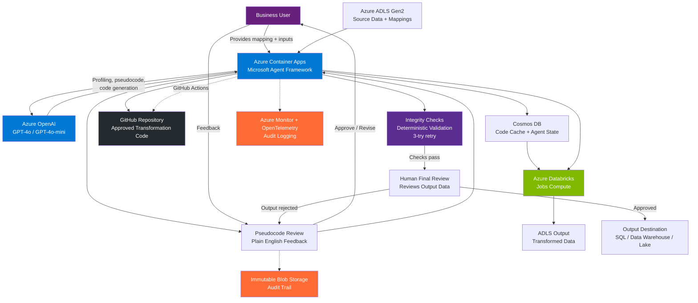

# AI Data Engineering Agent — Reference Architecture

**Purpose:** Reusable architecture for Microsoft field teams, partners, and customers
**Version:** 1.0
**Date:** February 6, 2026
**Stack:** Azure Container Apps + GitHub + Microsoft Agent Framework

---

## Overview

This reference architecture describes an **AI-powered data engineering agent** that automates data transformation development for enterprises managing diverse client data formats. The agent generates transformation code through a human-in-the-loop workflow, executes on Spark, and caches approved transformations for reuse.

**Target Scenario:** Any organization that:
- Manages data from hundreds or thousands of sources with unique formats
- Needs to standardize into a common output format
- Currently relies on manual data engineering (PySpark, SQL, ETL scripts)
- Requires audit trails and human approval for compliance

**Key Outcomes:**
- **8 hours → 30 minutes** per new transformation (94% reduction)
- **$800 → ~$2/run** (99.7% cost reduction vs. manual)
- **Self-service** for business users — no data engineering dependency
- **Full audit trail** with versioned code in GitHub

---

## Architecture

### Architecture Diagram



### Services & Components

| Component | Service | Purpose |
|-----------|---------|---------|
| **AI Agent Runtime** | Azure Container Apps + Microsoft Agent Framework | Orchestrate workflow, tool calling, checkpointing, scale-to-zero |
| **LLM Backend** | Azure OpenAI (GPT-4o / GPT-4o-mini) | Data analysis, pseudocode generation, PySpark code generation |
| **Data Storage** | Azure ADLS Gen2 | Source data, mappings, and output |
| **Big Data Processing** | Azure Databricks (Jobs Compute) | Execute PySpark transformations at scale |
| **Code Cache + Agent State** | Cosmos DB (serverless) | Runtime cache for transformations; agent conversation/thread state |
| **Approved Code Repository** | GitHub | Versioned transformation code, audit trail, CI/CD integration |
| **Audit Logging** | Azure Monitor + OpenTelemetry | Compliance trail (built-in Agent Framework tracing) |
| **Audit Storage** | Immutable Blob Storage | Immutable record of approvals, code, and execution history |
| **Integrity Checks** | Deterministic scripts (not AI) | Automated validation of output before human review |

### Why This Stack

| Choice | Rationale |
|--------|-----------|
| **Container Apps** | Built-in AI Foundry integration, scale-to-zero, serverless pricing, KEDA autoscaling. Microsoft's recommended compute for agentic AI workloads. |
| **GitHub** | Native MCP server support, GitHub Actions for CI/CD on generated code, Copilot integration path, familiar developer workflow. |
| **Agent Framework** | Production-grade orchestration (AutoGen + Semantic Kernel), built-in checkpointing, MCP support, OpenTelemetry tracing, $0 platform fee. |
| **Databricks (Jobs Compute)** | Per-job pricing (no idle capacity), Spot instances for 60% discount, customer-familiar, autoscaling 1-N workers. |
| **Cosmos DB** | Fast key-value lookups for cache, built-in `ChatMessageStore` for agent state, serverless pricing. |

---

## Agent Workflow (6 Phases)

### Phase 1: Cache Check
1. Agent receives trigger with source identifier and mapping path
2. Generates cache key: `hash(source_id + mapping_content + schema_fingerprint)`
3. **Cache Hit**: Retrieve approved PySpark → skip to Phase 4
4. **Cache Miss**: Continue to Phase 2

### Phase 2: Data Profiling & Pseudocode Generation
5. Agent reads mapping spreadsheet from ADLS (`read_mapping_spreadsheet` MCP tool)
6. Agent samples first 100 rows from source data (`sample_source_data` MCP tool)
7. Agent profiles the data: column types, null rates, distributions, anomalies
8. Agent generates transformation pseudocode in **plain English**
9. Pseudocode presented to human reviewer

### Phase 3: Human Review (Conversational)
10. Reviewer sees pseudocode (not PySpark — plain English descriptions)
11. Reviewer provides feedback conversationally (e.g., "Account numbers should be zero-padded to 10 digits")
12. Agent iterates on pseudocode until approved
13. Approval logged to immutable storage
14. Agent workflow checkpoints state

### Phase 4: Code Generation & Execution (3-Try Retry)
15. Agent generates PySpark from approved pseudocode (using GPT-4o-mini — mechanical translation)
16. Code saved to Cosmos DB cache + committed to GitHub repository
17. Spark job submitted to Azure Databricks (Jobs Compute)
18. **If execution fails**: Error log passed back to agent → agent fixes code → re-submit (up to 3 tries)

### Phase 5: Integrity Checks (Deterministic)
19. Reviewer script (not AI) runs automated checks:
    - Row count validation
    - Schema conformance
    - Null checks on required fields
    - Value range validation
    - Referential integrity
    - Sample spot-check against mapping rules
20. **If checks fail**: Error log passed back to agent → fix and re-execute (max 3 total tries across Phases 4-5)
21. **After 3 failures**: Surface error to human with details

### Phase 6: Human Final Review
22. Agent presents results **only after integrity checks pass**:
    - Transformation summary
    - Integrity check report
    - Sample output rows
23. Reviewer reviews the **output data** (not code)
24. **Approved**: Output loaded to destination, cache updated
25. **Rejected**: Feedback → loop back to Phase 3 (pseudocode revision). Entire pipeline is repeatable.

---

## Code Storage: Cosmos DB + GitHub

### Dual Storage Architecture

**Cosmos DB** handles runtime cache lookups for fast execution. **GitHub** provides the versioned audit trail.

```
Runtime Cache (Cosmos DB)             Approved Code (GitHub)
┌────────────────────────┐            ┌──────────────────────────────┐
│ Key: hash(id+map+schema)│           │ repo: org/data-transforms    │
│ Value:                  │──points──▶│ └── sources/                 │
│   pyspark_code          │   to      │     └── SOURCE_001/          │
│   pseudocode            │           │         ├── pseudocode_v1.md │
│   github_path           │           │         ├── transform_v1.py  │
│   status: approved      │           │         ├── pseudocode_v2.md │
│   execution_count: 42   │           │         └── transform_v2.py  │
└────────────────────────┘            └──────────────────────────────┘
```

**GitHub Workflow:**
- Agent commits approved code via GitHub API (or GitHub MCP server)
- Each source gets a directory with versioned pseudocode + PySpark
- Commit message includes: source_id, approver, transformation hash, timestamp
- GitHub Actions can run linting, security scanning, or additional validation on generated code
- Pull request workflow optional — automated commits for agent-approved code, PRs for manual review

**Why GitHub over ADO Repos:**
- Native MCP server (GitHub MCP Server) — agent interacts with repos through tool calls
- GitHub Actions for CI/CD on generated transformation code
- GitHub Copilot integration path for specialist code review
- Broader ecosystem and familiarity
- GitHub Advanced Security for scanning generated code

---

## Container Apps Configuration

### Why Container Apps

Azure Container Apps is Microsoft's **recommended compute for agentic AI workloads**:
- Built-in integration with Azure AI Foundry (sandbox environments, code interpreter)
- Scale-to-zero during idle periods (significant cost savings for variable workloads)
- KEDA autoscaling based on queue depth or HTTP traffic
- Serverless pricing — pay only for active compute
- Built-in observability with Azure Monitor
- VNet integration for private networking

### Agent Runtime Configuration

```yaml
# container-app.yaml
properties:
  configuration:
    ingress:
      external: false  # Internal only — no public access
      targetPort: 8080
    secrets:
      - name: azure-openai-endpoint
        keyVaultUrl: https://<vault>.vault.azure.net/secrets/openai-endpoint
  template:
    containers:
      - name: data-engineering-agent
        image: <acr>.azurecr.io/data-engineering-agent:latest
        resources:
          cpu: 4.0
          memory: 8Gi
        env:
          - name: AZURE_OPENAI_ENDPOINT
            secretRef: azure-openai-endpoint
    scale:
      minReplicas: 0   # Scale to zero when idle
      maxReplicas: 10   # Scale up for concurrent transformations
      rules:
        - name: queue-trigger
          custom:
            type: azure-servicebus
            metadata:
              queueName: transformation-requests
              messageCount: "5"
```

### Cost Profile

| Configuration | Monthly Cost | Notes |
|--------------|-------------|-------|
| Scale-to-zero (low volume) | $60-100 | Only pay when processing |
| Sustained (4 vCPU, 8 GB) | $155-240 | 24/7 operation |
| Burst (10 replicas peak) | $300-500 | Auto-scales during busy periods |

---

## Authentication & Authorization

All authentication uses **Azure Managed Identity** — no API keys.

| Connection | Method | RBAC Role |
|------------|--------|-----------|
| Container App → Azure OpenAI | Managed Identity | `Cognitive Services OpenAI User` |
| Container App → ADLS | Managed Identity | `Storage Blob Data Reader/Contributor` |
| Container App → Databricks | Managed Identity | `Contributor` on workspace |
| Container App → Cosmos DB | Managed Identity | `Cosmos DB Built-in Data Contributor` |
| Container App → GitHub | GitHub App or PAT (via Key Vault) | Repository write access |
| Databricks → ADLS | Unity Catalog / Service Principal | Storage access |

**Note:** GitHub authentication requires a GitHub App installation or PAT stored in Key Vault, since Managed Identity doesn't extend to GitHub. The GitHub MCP server handles auth transparently.

---

## MCP Tools

The agent interacts with external services through **MCP (Model Context Protocol)** tool servers. This decouples the agent logic from service-specific APIs.

| MCP Tool | Purpose | Phase | Transport |
|----------|---------|-------|-----------|
| `read_mapping_spreadsheet` | Parse Excel mapping from ADLS | 2 | stdio |
| `sample_source_data` | Read first N rows from ADLS | 2 | stdio |
| `profile_data` | Column types, nulls, distributions | 2 | stdio |
| `submit_spark_job` | Submit PySpark to Databricks Jobs API | 4 | stdio |
| `check_spark_job_status` | Poll Databricks job completion | 4 | stdio |
| `read_spark_output` | Read output data for validation | 5 | stdio |
| `run_integrity_checks` | Row counts, schema, nulls, ranges | 5 | stdio |
| `write_to_cache` | Store approved code in Cosmos DB | 4 | stdio |
| `read_from_cache` | Retrieve cached transformations | 1 | stdio |
| `commit_to_github` | Commit code to GitHub repository | 4 | stdio / GitHub MCP Server |

**GitHub MCP Server:** Microsoft provides an official GitHub MCP server that the agent can use for repository operations (commits, PRs, file reads). This is the recommended approach for GitHub integration.

---

## Implementation Pattern

### Agent Setup

```python
from agent_framework.azure import AzureOpenAIResponsesClient
from agent_framework import ChatAgent, MCPStdioTool
from azure.identity import DefaultAzureCredential

client = AzureOpenAIResponsesClient(
    credential=DefaultAzureCredential(),
    azure_endpoint="https://<resource>.openai.azure.com",
    model="gpt-4o",
)

agent = client.as_agent(
    name="DataEngineeringAgent",
    instructions="""You are a data engineering agent that:
    1. Profiles source data on ADLS
    2. Analyzes mapping spreadsheets
    3. Generates transformation pseudocode for human review
    4. Converts approved pseudocode to PySpark
    5. Validates output integrity before presenting to reviewer
    """,
)

async with (
    MCPStdioTool(name="adls-tools", command="python", args=["mcp_adls_server.py"]) as adls,
    MCPStdioTool(name="databricks-tools", command="python", args=["mcp_databricks_server.py"]) as databricks,
    MCPStdioTool(name="github-tools", command="python", args=["mcp_github_server.py"]) as github,
    agent,
):
    result = await agent.run(
        "Profile the data and analyze the mapping spreadsheet.",
        tools=[adls, databricks, github],
    )
```

### Workflow with Checkpointing and Retry

```python
from agent_framework.workflows import Workflow, checkpoint

MAX_RETRIES = 3

class TransformationWorkflow(Workflow):
    async def run(self, source_id: str, mapping_path: str):
        pseudocode = await self.agent.run(
            f"Profile and generate pseudocode for {source_id}"
        )

        while True:
            approval = await checkpoint("pseudocode_review", {
                "pseudocode": pseudocode,
                "source_id": source_id,
            })

            if not approval.approved:
                pseudocode = await self.agent.run(
                    f"Revise pseudocode: {approval.feedback}"
                )
                continue

            for attempt in range(MAX_RETRIES):
                pyspark_code = await self.agent.run(
                    f"Generate PySpark from: {pseudocode}"
                )
                result = await self.execute_spark_job(pyspark_code)

                if not result.success:
                    pyspark_code = await self.agent.run(
                        f"Fix code. Error: {result.error_log}"
                    )
                    continue

                checks = await self.run_integrity_checks(result.output)
                if checks.passed:
                    break
                pyspark_code = await self.agent.run(
                    f"Fix code. Check failures: {checks.errors}"
                )
            else:
                await checkpoint("failure_review", {
                    "error": "Max retries exceeded",
                    "last_error": checks.errors,
                })
                return

            final = await checkpoint("final_review", {
                "integrity_report": checks,
                "sample_output": result.sample_rows,
            })

            if final.approved:
                # Commit to GitHub + update cache
                await self.commit_to_github(source_id, pseudocode, pyspark_code)
                await self.update_cache(source_id, pseudocode, pyspark_code)
                break
            else:
                pseudocode = await self.agent.run(
                    f"Revise pseudocode: {final.feedback}"
                )
```

---

## Cost Model

### Per-Transformation Cost

| Phase | Model | Cost |
|-------|-------|------|
| Data profiling | GPT-4o-mini | $0.001 |
| Pseudocode generation | GPT-4o | $0.070 |
| Feedback iteration (1 round) | GPT-4o | $0.055 |
| PySpark code generation | GPT-4o-mini | $0.004 |
| Integrity check | GPT-4o-mini | $0.001 |
| **Total LLM per new transform** | | **~$0.13** |

### Monthly Cost at Scale

| Volume | Cache Hit | Monthly Cost | Per-Run |
|--------|-----------|-------------|---------|
| 100 runs | 0% (cold start) | ~$400 | $4.00 |
| 100 runs | 70% | ~$300 | $3.00 |
| 500 runs | 60% | ~$1,200 | $2.40 |
| 1,000 runs | 60% | ~$2,200 | $2.20 |
| 1,000 runs (Spot) | 60% | ~$1,100 | $1.10 |

**Cost Distribution (1,000 runs/month, 60% cache):**
- Databricks: ~80% (Spot instances reduce this by 60%)
- Container Apps: ~8%
- ADLS: ~7%
- Azure OpenAI: ~3%
- Other: ~2%

---

## Security

| Concern | Approach |
|---------|----------|
| **Data privacy** | Only metadata + 100-row sample sent to LLM. Full data stays on Spark. |
| **Secrets** | Azure Managed Identity everywhere. GitHub PAT in Key Vault. |
| **Network** | Container App in VNet with private endpoints. No public data paths. |
| **Generated code** | GitHub Advanced Security scans generated PySpark for vulnerabilities. |
| **Access control** | RBAC on all Azure resources. GitHub repo permissions for code access. |
| **Audit** | OpenTelemetry traces for every agent action. Immutable blob for approvals. |

---

## Deployment

### Prerequisites
- Azure subscription with: Container Apps, Azure OpenAI, Databricks, ADLS Gen2, Cosmos DB
- GitHub organization with repository for transformation code
- Azure Container Registry for agent container image

### Quick Start

```bash
# 1. Create resource group
az group create -n rg-data-agent -l eastus

# 2. Deploy Container Apps environment
az containerapp env create -n data-agent-env -g rg-data-agent

# 3. Deploy agent
az containerapp create \
  --name data-engineering-agent \
  --resource-group rg-data-agent \
  --environment data-agent-env \
  --image <acr>.azurecr.io/data-engineering-agent:latest \
  --cpu 4.0 --memory 8Gi \
  --min-replicas 0 --max-replicas 10 \
  --system-assigned

# 4. Assign RBAC roles to managed identity
IDENTITY=$(az containerapp show -n data-engineering-agent -g rg-data-agent --query identity.principalId -o tsv)

az role assignment create --assignee $IDENTITY \
  --role "Cognitive Services OpenAI User" \
  --scope /subscriptions/<sub>/resourceGroups/<rg>/providers/Microsoft.CognitiveServices/accounts/<openai>

az role assignment create --assignee $IDENTITY \
  --role "Storage Blob Data Contributor" \
  --scope /subscriptions/<sub>/resourceGroups/<rg>/providers/Microsoft.Storage/storageAccounts/<adls>

az role assignment create --assignee $IDENTITY \
  --role "Cosmos DB Built-in Data Contributor" \
  --scope /subscriptions/<sub>/resourceGroups/<rg>/providers/Microsoft.DocumentDB/databaseAccounts/<cosmos>
```

---

## Adapting This Architecture

This reference architecture is designed to be adapted to customer constraints. Common substitutions:

| Component | Default (This Doc) | Common Alternatives |
|-----------|-------------------|-------------------|
| Agent Runtime | Azure Container Apps | AKS, Azure Durable Functions, Azure App Service |
| Code Repository | GitHub | Azure DevOps Repos, GitLab |
| Spark Engine | Azure Databricks | Microsoft Fabric, Synapse Spark |
| LLM | Azure OpenAI (GPT-4o) | Any model via Agent Framework |
| Output Destination | ADLS / SQL | Snowflake, Data Warehouse, APIs |

**Customer-Specific Deployment:** See `design.md` for an example adaptation using AKS/Durable Functions + ADO Repos to match an existing customer tech stack.

---

*This reference architecture is maintained by the Microsoft AI + Data Engineering team. For questions or contributions, see the GitHub repository.*
